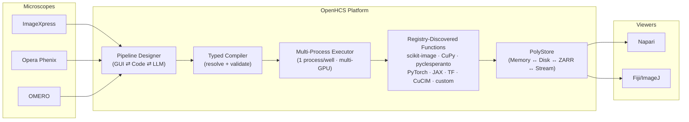
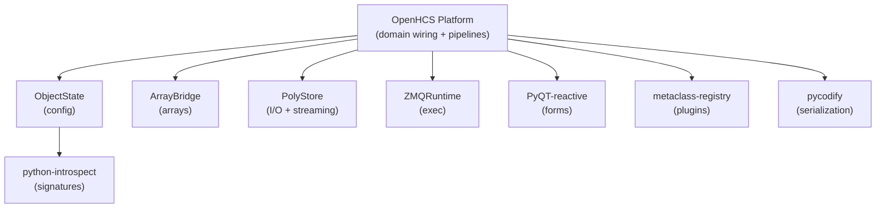

<!-- mcp-name: io.github.OpenHCSDev/openhcs -->

<div align="center">


<h1>OpenHCS</h1>

**Bioimage analysis platform for high-content screening**\
**Compile-time validation · Bidirectional GUI↔Code · Multi-GPU · LLM pipeline generation · Extensible function registry**

[](https://pypi.org/project/openhcs/)
[](https://opensource.org/licenses/MIT)
[](https://www.python.org/downloads/)
[](https://github.com/OpenHCSDev/OpenHCS)
[](https://openhcs.readthedocs.io)

</div>

---

## 🎬 Demo

[](https://openhcs.readthedocs.io/en/latest/_static/openhcs.mp4)

Watch demo in browser player: https://openhcs.readthedocs.io/en/latest/_static/openhcs.mp4  
Mirror link (GitHub raw): https://raw.githubusercontent.com/OpenHCSDev/OpenHCS/refs/heads/main/docs/source/_static/openhcs.mp4

---

OpenHCS processes large microscopy datasets with a **compile-then-execute**
architecture. Pipelines are validated across the selected execution axes *before*
processing starts, preventing late failures after expensive work. Design
pipelines in the GUI, export to Python, edit as code, and re-import — switching
between visual and programmatic workflows.



---

## ⚡ Key Capabilities

<table>
<tr>
<td width="50%" valign="top">

### 🛡️ Compile-Time Validation
Configuration is resolved once into step snapshots and a compilation session. Typed plans then validate sources, artifacts, materialization, memory contracts, and worker requirements before execution begins. Errors surface immediately, not after hours of processing.

</td>
<td width="50%" valign="top">

### 🔄 Bidirectional GUI ↔ Code
Design pipelines visually, export as executable Python, edit in your IDE, re-import to the GUI. Code generation works at **any scope level** — function patterns, individual steps, pipeline configs, full orchestrator scripts — any window holding objects can generate and re-import code.

</td>
</tr>
<tr>
<td width="50%" valign="top">

### 🧠 LLM Pipeline Generation
Describe a pipeline in natural language and get executable code. Built-in chat panel with local Ollama or remote LLM endpoints. Dynamic system prompts built from the actual function registry — the LLM knows every available function and its signature.

</td>
<td width="50%" valign="top">

### ⚡ Full Multiprocessing & Multi-GPU
Bounded worker lanes use `ProcessPoolExecutor` by default, with deterministic
well assignment and sequential processing inside each lane. A GPU scheduler
assigns devices to workers; single-worker and debugging configurations can use
inline or threaded execution.

</td>
</tr>
<tr>
<td width="50%" valign="top">

### 🔌 Any Python Function
Register **any** Python function by decorating it with `@numpy`, `@cupy`, `@pyclesperanto`, `@torch`, or other memory type decorators. Custom functions get automatic contract validation, UI integration, and appear alongside built-in functions. Persisted to `~/.openhcs/custom_functions/`.

</td>
<td width="50%" valign="top">

### 📊 Results Materialization
Callable and module artifact contracts declare semantic outputs independently of Python argument names. The artifact graph and materialization plans route images, measurements, object labels, relationships, tables, and files to their configured stores and exporters.

</td>
</tr>
<tr>
<td width="50%" valign="top">

### 🔬 Process-Isolated Napari & Fiji
Stream images to **Napari** and **Fiji/ImageJ** in real time during pipeline execution. OpenHCS `StreamingConfig` declarations and viewer adapters own identity, display, and persistence policy. PolyStore builds generic storage and streaming payloads; ZMQRuntime supplies process-isolated transport, readiness, acknowledgments, and lifecycle.

</td>
<td width="50%" valign="top">

### 🪟 Live Cross-Window Updates
Edit a value in `GlobalPipelineConfig` — watch it propagate in real-time to `PipelineConfig` and `StepConfig` windows. Dual-axis resolution (context hierarchy × class MRO) with scope isolation per orchestrator.

</td>
</tr>
<tr>
<td width="50%" valign="top">

### 🧬 CellProfiler Pipeline Import
Open `.cppipe` files in the desktop application or lower them from Python into ordinary `PipelineConfig` and `FunctionStep` declarations. Named images, objects, measurements, relationships, and exports use the same typed compiler and runtime as native OpenHCS pipelines; compatibility reports and the Official30 corpus keep tested coverage explicit.

</td>
<td width="50%" valign="top">

### 🤖 MCP Agent Automation
Use the local stdio MCP server with Codex, Claude Desktop, and other clients, or deploy the separately secured hosted HTTP surface. Capability profiles, schemas, knowledge, UI attachment, authoring, execution, runtime inspection, and viewer review are projected from one typed capability registry rather than duplicated tool lists.

</td>
</tr>
</table>

---

## 🧩 The OpenHCS Ecosystem

OpenHCS is built on **8 purpose-extracted libraries** — each solving a general problem, each independently publishable, all woven into a cohesive platform:



| Library | Role in OpenHCS | What It Does |
|:--------|:----------------|:-------------|
| [**ObjectState**](https://github.com/OpenHCSDev/ObjectState) | Configuration framework | Lazy dataclasses with dual-axis inheritance (context hierarchy × class MRO) and `contextvars`-based resolution |
| [**ArrayBridge**](https://github.com/OpenHCSDev/ArrayBridge) | Memory type conversion | Unified API across NumPy, CuPy, PyTorch, JAX, TensorFlow, pyclesperanto with DLPack zero-copy transfers |
| [**PolyStore**](https://github.com/OpenHCSDev/PolyStore) | Unified I/O & stream payloads | Generic storage and streaming payload primitives, backend lifecycle, virtual workspaces, atomic writes, format detection, and ROI extraction |
| [**ZMQRuntime**](https://github.com/OpenHCSDev/ZMQRuntime) | Process & transport runtime | Generic request, status, progress, cancellation, process-lifecycle, and viewer-control transport protocols |
| [**PyQT-reactive**](https://github.com/OpenHCSDev/PyQT-reactive) | UI form generation | React-style reactive forms from dataclasses with cross-window sync and flash animations |
| [**pycodify**](https://github.com/OpenHCSDev/pycodify) | Code ↔ object conversion | Python source as serialization format — type-preserving, diffable, editable, with collision handling |
| [**python-introspect**](https://github.com/OpenHCSDev/python-introspect) | Signature analysis | Pure-Python function/dataclass introspection for automatic UI generation and contract analysis |
| [**metaclass-registry**](https://github.com/OpenHCSDev/metaclass-registry) | Plugin discovery | Zero-boilerplate registry system powering microscope handler and storage backend auto-discovery |

---

## 🔬 Microscope & Function Support

<table>
<tr>
<td width="40%" valign="top">

**Microscope Systems**

| System | Vendor |
|:-------|:-------|
| ImageXpress | Molecular Devices |
| Opera Phenix | PerkinElmer |
| OMERO | Open Microscopy |
| OpenHCS Format | Native |

Auto-detected. Extensible via `metaclass-registry`.

</td>
<td width="60%" valign="top">

**Functions — Automatic Discovery**

| Library | Functions | Acceleration |
|:--------|:---------:|:------------:|
| pyclesperanto | 230+ | OpenCL GPU |
| CuCIM/CuPy | 124+ | CUDA GPU |
| scikit-image | 110+ | CPU |
| PyTorch / JAX / TF | ✓ | CUDA GPU |
| OpenHCS native | ✓ | Mixed |

Unified contracts, automatic memory conversion via `ArrayBridge`.

</td>
</tr>
</table>

**Processing domains**: image preprocessing · segmentation · cell counting · stitching (MIST + Ashlar GPU) · neurite tracing · morphology · measurements

---

## 🚀 Quick Start

```bash
# Basic installation with GUI
pip install openhcs[gui]

# Add Napari viewer
pip install openhcs[gui,napari]

# Add Fiji/ImageJ viewer
pip install openhcs[gui,fiji]

# Add both viewers
pip install openhcs[gui,viz]

# Add GPU acceleration (CUDA 12.x required)
pip install openhcs[gui,gpu]

# Full installation (GUI + viewers + GPU)
pip install openhcs[gui,viz,gpu]

# Add the local MCP server for agent clients
pip install openhcs[gui,mcp,viz]

# Launch the application
openhcs

# Launch the local MCP server over stdio
openhcs-mcp
```

```python
# Or lower a CellProfiler pipeline into public OpenHCS declarations
from pathlib import Path

from objectstate import ensure_global_config_context
from openhcs.core.config import GlobalPipelineConfig
from openhcs.core.orchestrator.orchestrator import PipelineOrchestrator
from openhcs.interop.cellprofiler.pipeline_import import import_cellprofiler_pipeline

plate_path = Path("/data/plate").resolve()
ensure_global_config_context(GlobalPipelineConfig, GlobalPipelineConfig())
steps, pipeline_config = import_cellprofiler_pipeline(
    "analysis.cppipe",
    source_root=plate_path,
)

orchestrator = PipelineOrchestrator(
    plate_path,
    pipeline_config=pipeline_config,
).initialize()
compilation = orchestrator.compile_pipelines(steps)
execution_bundle = compilation["execution_bundle"]
```

The GUI and execution services consume the same `list[FunctionStep]`,
`PipelineConfig`, and typed execution bundle. See the
[API orientation](https://openhcs.readthedocs.io/en/latest/api/) for the explicit
low-level execution call and progress lifecycle.

<details>
<summary><b>📦 All installation options</b></summary>

```bash
pip install openhcs              # Headless (servers, CI)
pip install openhcs[gui]         # Desktop GUI
pip install openhcs[gui,napari]  # GUI + Napari viewer
pip install openhcs[gui,viz]     # GUI + Napari + Fiji
pip install openhcs[gui,viz,gpu] # Full installation
pip install openhcs[gpu]         # Headless + GPU
pip install openhcs[omero]       # OMERO integration
pip install -e ".[all,dev]"      # Development (all features)
```

The `gpu` extra requires a compatible CUDA 12 environment. For a CPU-only
desktop installation, install `openhcs[gui]` without the `gpu` extra.

</details>

<details>
<summary><b>🗄️ OMERO integration</b></summary>

OMERO requires `zeroc-ice`, whose compatible wheels are not published through
the normal project metadata. Install the helper requirements before the extra:

```bash
python scripts/install_omero_deps.py
pip install 'openhcs[omero]'
```

Equivalent requirements-file installation:
```bash
pip install -r requirements-omero.txt
pip install 'openhcs[omero]'
```

Supported on Python 3.11 and 3.12. See [Glencoe Software](https://www.glencoesoftware.com/blog/2023/12/08/ice-binaries-for-omero.html) for manual installation.

</details>

---

## 📖 Documentation

| | |
|:---|:---|
| 📘 **[Read the Docs](https://openhcs.readthedocs.io/)** | Full API docs, tutorials, guides |
| 🏗️ **[Architecture](https://openhcs.readthedocs.io/en/latest/architecture/)** | Typed compiler · sources · artifacts · runtime values · package boundaries |
| 🎓 **[Getting Started](https://openhcs.readthedocs.io/en/latest/getting_started/)** | Installation · First pipeline |

---

## ⚙️ Architecture Highlights

<details>
<summary><b>Resolved, typed pipeline compilation</b> — catch errors before execution starts</summary>

```
PipelineConfig + list[FunctionStep]
        ↓ resolve once
StepSnapshot + CompilationSession
        ↓ derive and validate
typed CompiledStepPlan objects
        ↓ package
CompiledExecutionBundle
        ↓ execute
runtime values + materialized artifacts
```

The authoring surface remains an ordered linear step list. ObjectState
inheritance keeps defaulted configuration sparse, while compilation derives and
exposes the exact source and artifact dependencies required for execution; the
derived dependency graph is not a second workflow the user must author.

Pipelines are compiled for every selected execution axis before processing begins. Runtime workers consume the compiled bundle rather than reinterpreting mutable declaration objects. [Read more →](https://openhcs.readthedocs.io/en/latest/architecture/pipeline-compilation-system.html)

</details>

<details>
<summary><b>Dual-Axis Configuration</b> — context hierarchy × class MRO</summary>

Resolution walks two axes simultaneously: the **context stack** (Global → Pipeline → Step) and the **class MRO** (inheritance chain). Built on `contextvars` for thread-safe, scope-isolated resolution. Preserves `None` vs concrete value distinction for proper field-level inheritance. Powered by `ObjectState`. [Read more →](https://openhcs.readthedocs.io/en/latest/architecture/configuration_framework.html)

</details>

<details>
<summary><b>Bidirectional GUI ↔ Code</b> — code generation at any scope level</summary>

Any window holding `ObjectState` objects can generate and re-import executable Python:

```
Function patterns · Individual steps · Pipeline configs · Full orchestrator scripts
              ↕  generate / AST-parse back  ↕
```

Each scope encapsulates all lower-scope imports. Generated code is fully executable without additional setup. Edit in your IDE or external editor, save, and the GUI re-imports via AST parsing. Powered by `pycodify` + `python-introspect`. [Read more →](https://openhcs.readthedocs.io/en/latest/architecture/code_ui_interconversion.html)

</details>

<details>
<summary><b>Cross-Window Live Updates</b> — class-level registry + Qt signals</summary>

A class-level registry tracks all active form managers. When a value changes in any config window, Qt signals propagate the change to every affected window with debounced, scope-isolated refreshes. Global → Pipeline → Step cascading with per-orchestrator isolation. Powered by `PyQT-reactive`. [Read more →](https://openhcs.readthedocs.io/en/latest/architecture/parameter_form_lifecycle.html)

</details>

<details>
<summary><b>More patterns</b> — storage, viewer integration, function discovery, memory types</summary>

- **Storage and viewer streaming**: PolyStore owns generic storage and streaming payload primitives; ZMQRuntime owns process, transport, readiness, acknowledgment, and lifecycle protocols; OpenHCS `StreamingConfig` declarations plus the Napari/Fiji adapters own viewer identity, display, and application policy.
- **Automatic Function Discovery**: registry-discovered functions with contract analysis and type-safe integration via `python-introspect` + `metaclass-registry`
- **Memory Type Management**: Compile-time validation of array type compatibility with zero-copy conversion via `ArrayBridge`
- **Custom Function Registration**: Any Python function decorated with `@numpy`, `@cupy`, `@pyclesperanto`, etc. is auto-integrated with contracts, UI forms, and the function registry
- **Evolution-Proof UI**: Type-based form generation from Python annotations — adapts automatically when signatures change

[Full architecture docs →](https://openhcs.readthedocs.io/en/latest/architecture/)

</details>

---

## 🤝 Contributing

```bash
git clone --recurse-submodules https://github.com/OpenHCSDev/OpenHCS.git
cd OpenHCS
# Install the eight local packages as described in docs/development_setup.md,
# then install OpenHCS itself:
python -m pip install -e ".[dev,gui]"
OPENHCS_CPU_ONLY=1 python -m pytest tests/unit
```

**Contribution areas**: microscope formats · processing functions · GPU backends · documentation

---

## 📄 License

MIT — see [LICENSE](LICENSE).

## 🙏 Acknowledgments

OpenHCS evolved from [EZStitcher](https://github.com/OpenHCSDev/ezstitcher) and builds on [Ashlar](https://github.com/labsyspharm/ashlar) (stitching), [MIST](https://github.com/usnistgov/MIST) (phase correlation), [pyclesperanto](https://github.com/clEsperanto/pyclesperanto_prototype) (GPU image processing), and [scikit-image](https://scikit-image.org/) (image analysis).

OpenHCS's CellProfiler interoperability and parity validation build on the CellProfiler project's open-source software, documentation, and public example, tutorial, and benchmark materials. We thank the CellProfiler authors and contributors and the authors of the biological datasets they distribute. Please cite CellProfiler following its [official citation guidance](https://cellprofiler.org/citations), including [Stirling et al., *CellProfiler 4: improvements in speed, utility and usability* (2021)](https://doi.org/10.1186/s12859-021-04344-9). OpenHCS is an independent project and is not endorsed by the CellProfiler project or the Broad Institute.
