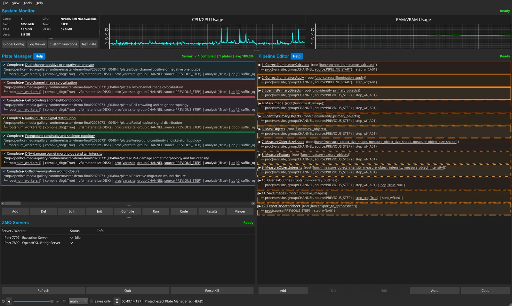
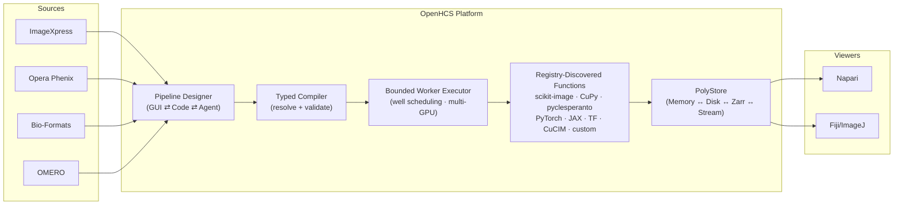
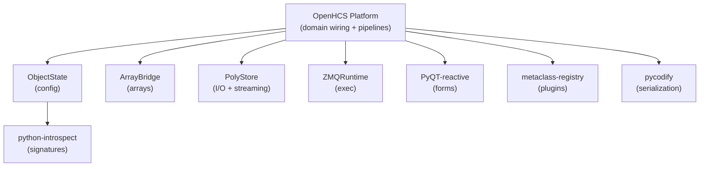

<!-- mcp-name: io.github.OpenHCSDev/openhcs -->

<div align="center">


<h1>OpenHCS</h1>

**Turn high-content microscopy images into reproducible measurements**\
**One reviewable workflow across the GUI, Python, CellProfiler, and local agents**

[](https://pypi.org/project/openhcs/)
[](https://opensource.org/licenses/MIT)
[](https://www.python.org/downloads/)
[](https://github.com/OpenHCSDev/OpenHCS)
[](https://openhcs.readthedocs.io)

</div>

OpenHCS is designed for imaging scientists and research software teams running
high-content studies where many wells, sites, channels, Z planes, or time points
must be analysed consistently. Source selection, processing steps, and result
definitions stay together in one validated pipeline instead of being split
across interface-only state, scripts, and automation.

It is a good fit when a workflow must remain reviewable across visual editing,
code, and automation. The same pipeline can be edited in the desktop GUI or as
Python, imported from supported CellProfiler `.cppipe` files, and built or
reviewed through the local MCP surface.

### Install

[**Windows installer**](https://github.com/OpenHCSDev/OpenHCS/releases/latest/download/OpenHCS-Windows-Installer.exe) ·
[**macOS installer**](https://github.com/OpenHCSDev/OpenHCS/releases/latest/download/OpenHCS-macOS-Installer.dmg) ·
[**Installation options**](https://openhcsdev.github.io/openhcs/#install)

The graphical installers set up an isolated CPU-safe desktop environment with
the OpenHCS GUI, CellProfiler compatibility, local MCP server, Napari,
Fiji/ImageJ, and Bio-Formats. GPU libraries remain optional.

---

## See OpenHCS in use

[](https://openhcsdev.github.io/openhcs/#gallery)

[Browse the UI and viewer gallery](https://openhcsdev.github.io/openhcs/#gallery) ·
[Watch an agent build, debug, run, and inspect a workflow](https://openhcsdev.github.io/openhcs/#mcp)

---

OpenHCS processes large microscopy datasets with a **compile-then-execute**
architecture. Pipelines are validated across the selected execution axes *before*
processing starts, preventing late failures after expensive work. Design
pipelines in the GUI, export to Python, edit as code, and re-import — switching
between visual and programmatic workflows. The local MCP exposes that same
workflow model to supported agents, so agent-authored pipelines remain visible,
editable, and reviewable in the GUI and generated Python.



---

## ⚡ Key Capabilities

<table>
<tr>
<td width="50%" valign="top">

### 🛡️ Compile-Time Validation
Configuration is resolved once into step snapshots and a compilation session. Typed plans then validate sources, artifacts, materialization, memory contracts, and worker requirements before execution begins. Errors surface immediately, not after hours of processing.

</td>
<td width="50%" valign="top">

### 🔄 Bidirectional GUI ↔ Code
Design pipelines visually, export as executable Python, edit in your IDE, re-import to the GUI. Code generation works at **any scope level** — function patterns, individual steps, pipeline configs, full orchestrator scripts — any window holding objects can generate and re-import code.

</td>
</tr>
<tr>
<td width="50%" valign="top">

### 🧠 Agent-Assisted Workflows
Give a supported MCP client a microscopy folder or plate and an analysis goal. It can inspect the connected execution server's functions, build and validate a typed pipeline, run it, inspect results in OpenHCS or a viewer, and revise the generated Python.

</td>
<td width="50%" valign="top">

### ⚡ Multiprocessing & GPU Acceleration
Bounded worker lanes use `ProcessPoolExecutor` by default, with deterministic
well assignment and sequential processing inside each lane. Compiled callable
contracts select framework-local GPU devices independently; single-worker and
debugging configurations can use inline or threaded execution.

</td>
</tr>
<tr>
<td width="50%" valign="top">

### 🔌 Any Python Function
Register **any** Python function by decorating it with `@numpy`, `@cupy`, `@pyclesperanto`, `@torch`, or another memory-type decorator. Custom functions receive contract validation, UI integration, multiprocessing-safe import identity, and the same server-owned catalog projection as built-in functions. Persisted functions live in the platform-specific OpenHCS user-data directory.

</td>
<td width="50%" valign="top">

### 📊 Results Materialization
Callable and module artifact contracts declare semantic outputs independently of Python argument names. The artifact graph and materialization plans route images, measurements, object labels, relationships, tables, and files to their configured stores and exporters.

</td>
</tr>
<tr>
<td width="50%" valign="top">

### 🔬 Process-Isolated Napari & Fiji
Stream images to **Napari** and **Fiji/ImageJ** in real time during pipeline execution. OpenHCS `StreamingConfig` declarations and viewer adapters own identity, display, and persistence policy. PolyStore builds generic storage and streaming payloads; ZMQRuntime supplies process-isolated transport, readiness, acknowledgments, and lifecycle.

</td>
<td width="50%" valign="top">

### 🪟 Live Cross-Window Updates
Edit a value in `GlobalPipelineConfig` — watch it propagate in real-time to `PipelineConfig` and `StepConfig` windows. Dual-axis resolution (context hierarchy × class MRO) with scope isolation per orchestrator.

</td>
</tr>
<tr>
<td width="50%" valign="top">

### 🧬 CellProfiler Pipeline Import
Open `.cppipe` files in the desktop application or lower them from Python into ordinary `PipelineConfig` and `FunctionStep` declarations. Named images, objects, measurements, relationships, and exports use the same typed compiler and runtime as native OpenHCS pipelines. The source-backed Official30 suite continuously exercises 30 pipelines from CellProfiler examples, tutorials, and benchmark supplements under explicit equivalence policies.

</td>
<td width="50%" valign="top">

### 🤖 MCP Agent Automation
Use the local stdio MCP server with ChatGPT desktop, Codex, Claude Desktop, and other supported clients, or deploy the separately secured HTTP surface. The graphical installers register detected local clients automatically. Capability profiles, schemas, knowledge, UI attachment, authoring, execution, runtime inspection, viewer review, and governed custom-function registration are projected from typed authorities rather than duplicated tool lists.

</td>
</tr>
</table>

---

## 🧩 The OpenHCS Ecosystem

OpenHCS is built on **8 purpose-extracted, separately published libraries** — each solving a general problem and all composed into one platform:



| Library | Role in OpenHCS | What It Does |
|:--------|:----------------|:-------------|
| [**ObjectState**](https://github.com/OpenHCSDev/ObjectState) | Configuration framework | Lazy dataclasses with dual-axis inheritance (context hierarchy × class MRO) and `contextvars`-based resolution |
| [**ArrayBridge**](https://github.com/OpenHCSDev/ArrayBridge) | Memory type conversion | Unified API across NumPy, CuPy, PyTorch, JAX, TensorFlow, pyclesperanto with DLPack zero-copy transfers |
| [**PolyStore**](https://github.com/OpenHCSDev/PolyStore) | Unified I/O & stream payloads | Generic storage and streaming payload primitives, backend lifecycle, virtual workspaces, atomic writes, format detection, and ROI extraction |
| [**ZMQRuntime**](https://github.com/OpenHCSDev/ZMQRuntime) | Process & transport runtime | Generic request, status, progress, cancellation, process-lifecycle, and viewer-control transport protocols |
| [**PyQT-reactive**](https://github.com/OpenHCSDev/PyQT-reactive) | UI form generation | React-style reactive forms from dataclasses with cross-window sync and flash animations |
| [**pycodify**](https://github.com/OpenHCSDev/pycodify) | Code ↔ object conversion | Python source as serialization format — type-preserving, diffable, editable, with collision handling |
| [**python-introspect**](https://github.com/OpenHCSDev/python-introspect) | Signature analysis | Pure-Python function/dataclass introspection for automatic UI generation and contract analysis |
| [**metaclass-registry**](https://github.com/OpenHCSDev/metaclass-registry) | Plugin discovery | Zero-boilerplate registry system powering microscope handler and storage backend auto-discovery |

---

## 🔬 Microscope & Function Support

<table>
<tr>
<td width="40%" valign="top">

**Image Sources**

| Source | Support |
|:-------|:--------|
| ImageXpress | Native plate and metadata handling |
| Opera Phenix | Native plate and metadata handling |
| Bio-Formats | Arbitrary folders and supported microscopy containers |
| OMERO | Remote image and metadata access |
| OpenHCS format | Native generated and materialized plates |

Source handlers are auto-detected and extensible through `metaclass-registry`.

</td>
<td width="60%" valign="top">

**Functions — Automatic Discovery**

| Library or route | Execution memory |
|:-----------------|:-----------------|
| scikit-image and OpenHCS native | NumPy / CPU |
| pyclesperanto | OpenCL GPU |
| CuPy and cuCIM | CUDA GPU |
| PyTorch, JAX, and TensorFlow functions | Declared CPU/GPU arrays |
| User custom functions | Declared by their memory-type decorator |

The connected execution server owns the available catalog, so remote GPU and
custom-function availability is reflected without a manually maintained list.
`ArrayBridge` provides compatible memory conversion, including zero-copy paths
where supported.

</td>
</tr>
</table>

**Processing domains**: image preprocessing · segmentation · cell counting · stitching (MIST + Ashlar GPU) · neurite tracing · morphology · measurements

Dimensionality is function-defined rather than a global mode: true volumetric
segmentation and measurement routes coexist with plane-local functions, whose
labels are not silently stitched across Z. See the
[dimensionality and measurement capability reference](https://openhcs.readthedocs.io/en/latest/reference/dimensionality_and_measurements.html).

---

## 🚀 Quick Start

For most desktop users, download the
[Windows installer](https://github.com/OpenHCSDev/OpenHCS/releases/latest/download/OpenHCS-Windows-Installer.exe)
or [macOS installer](https://github.com/OpenHCSDev/OpenHCS/releases/latest/download/OpenHCS-macOS-Installer.dmg).
Neither download requires ZIP extraction or an existing Python installation.
When upgrading OpenHCS 0.7.23 or earlier, follow the
[one-time installer migration](https://openhcs.readthedocs.io/en/latest/getting_started/getting_started.html#installation).

If macOS blocks the official bootstrap because it is unsigned and not notarised,
try to open **OpenHCS Installer.app**, then go to **System Settings > Privacy &
Security**, scroll to **Security**, click **Open Anyway**, authenticate, and
confirm **Open**. Only override Gatekeeper for the disk image downloaded from
the official OpenHCS GitHub release. [Apple documents the current recovery
steps here.](https://support.apple.com/guide/mac-help/open-an-app-by-overriding-security-settings-mh40617/mac)

For a manual installation, create a virtual environment and install the same
CPU-safe desktop surface as the graphical installers:

```bash
# Complete CPU-safe desktop environment
python -m pip install "openhcs[gui,viz,bioformats,mcp,cellprofiler-compat]"

# Launch the application
openhcs

# Launch the local MCP server over stdio
openhcs-mcp
```

Smaller environments can select only the required features:

```bash
# Basic installation with GUI
python -m pip install "openhcs[gui]"

# Add Napari viewer
python -m pip install "openhcs[gui,napari]"

# Add Fiji/ImageJ viewer
python -m pip install "openhcs[gui,fiji]"

# Add both viewers
python -m pip install "openhcs[gui,viz]"

# Add GPU acceleration on a compatible CUDA 12 system
python -m pip install "openhcs[gui,gpu]"

# Full installation (GUI + viewers + GPU)
python -m pip install "openhcs[gui,viz,gpu]"

# Add the local MCP server for agent clients
python -m pip install "openhcs[gui,mcp,viz]"
```

```python
# Or lower a CellProfiler pipeline into public OpenHCS declarations
from pathlib import Path

from objectstate import ensure_global_config_context
from openhcs.core.config import GlobalPipelineConfig
from openhcs.core.orchestrator.orchestrator import PipelineOrchestrator
from openhcs.interop.cellprofiler.pipeline_import import import_cellprofiler_pipeline

plate_path = Path("/data/plate").resolve()
ensure_global_config_context(GlobalPipelineConfig, GlobalPipelineConfig())
steps, pipeline_config = import_cellprofiler_pipeline(
    "analysis.cppipe",
    source_root=plate_path,
)

orchestrator = PipelineOrchestrator(
    plate_path,
    pipeline_config=pipeline_config,
).initialize()
execution_bundle = orchestrator.compile_pipelines(steps)
```

The GUI and execution services consume the same `list[FunctionStep]`,
`PipelineConfig`, and typed execution bundle. See the
[API orientation](https://openhcs.readthedocs.io/en/latest/api/) for the explicit
low-level execution call and progress lifecycle.

<details>
<summary><b>📦 All installation options</b></summary>

```bash
python -m pip install "openhcs"              # Headless engine
python -m pip install "openhcs[gui]"         # Desktop GUI
python -m pip install "openhcs[gui,napari]"  # GUI + Napari viewer
python -m pip install "openhcs[gui,viz]"     # GUI + Napari + Fiji
python -m pip install "openhcs[gui,viz,gpu]" # Full installation
python -m pip install "openhcs[gpu]"         # Headless + GPU
python -m pip install "openhcs[omero]"       # OMERO integration
python -m pip install -e ".[all,dev]"         # Development (all features)
```

The `gpu` extra requires a compatible CUDA 12 environment on a supported
NVIDIA platform. For a CPU-only
desktop installation, install `openhcs[gui]` without the `gpu` extra.

</details>

<details>
<summary><b>🗄️ OMERO integration</b></summary>

OMERO requires `zeroc-ice`, whose compatible wheels are not published through
the normal project metadata. Install the helper requirements before the extra:

```bash
python scripts/install_omero_deps.py
pip install 'openhcs[omero]'
```

Equivalent requirements-file installation:
```bash
pip install -r requirements-omero.txt
pip install 'openhcs[omero]'
```

Supported on Python 3.11 and 3.12. See [Glencoe Software](https://www.glencoesoftware.com/blog/2023/12/08/ice-binaries-for-omero.html) for manual installation.

</details>

---

## 📖 Documentation

| | |
|:---|:---|
| 📘 **[Read the Docs](https://openhcs.readthedocs.io/)** | Full API docs, tutorials, guides |
| 🏗️ **[Architecture](https://openhcs.readthedocs.io/en/latest/architecture/)** | Typed compiler · sources · artifacts · runtime values · package boundaries |
| 🎓 **[Getting Started](https://openhcs.readthedocs.io/en/latest/getting_started/)** | Installation · First pipeline |

---

## ⚙️ Architecture Highlights

<details>
<summary><b>Resolved, typed pipeline compilation</b> — catch errors before execution starts</summary>

```
PipelineConfig + list[FunctionStep]
        ↓ resolve once
StepSnapshot + CompilationSession
        ↓ derive and validate
typed CompiledStepPlan objects
        ↓ package
CompiledExecutionBundle
        ↓ execute
runtime values + materialized artifacts
```

The authoring surface remains an ordered linear step list. ObjectState
inheritance keeps defaulted configuration sparse, while compilation derives and
exposes the exact source and artifact dependencies required for execution; the
derived dependency graph is not a second workflow the user must author.

Pipelines are compiled for every selected execution axis before processing begins. Runtime workers consume the compiled bundle rather than reinterpreting mutable declaration objects. [Read more →](https://openhcs.readthedocs.io/en/latest/architecture/pipeline-compilation-system.html)

</details>

<details>
<summary><b>Dual-Axis Configuration</b> — context hierarchy × class MRO</summary>

Resolution walks two axes simultaneously: the **context stack** (Global → Pipeline → Step) and the **class MRO** (inheritance chain). Built on `contextvars` for thread-safe, scope-isolated resolution. Preserves `None` vs concrete value distinction for proper field-level inheritance. Powered by `ObjectState`. [Read more →](https://openhcs.readthedocs.io/en/latest/architecture/configuration_framework.html)

</details>

<details>
<summary><b>Bidirectional GUI ↔ Code</b> — code generation at any scope level</summary>

Any window holding `ObjectState` objects can generate and re-import executable Python:

```
Function patterns · Individual steps · Pipeline configs · Full orchestrator scripts
              ↕  generate / AST-parse back  ↕
```

Each scope encapsulates all lower-scope imports. Generated code is fully executable without additional setup. Edit in your IDE or external editor, save, and the GUI re-imports via AST parsing. Powered by `pycodify` + `python-introspect`. [Read more →](https://openhcs.readthedocs.io/en/latest/architecture/code_ui_interconversion.html)

</details>

<details>
<summary><b>Cross-Window Live Updates</b> — class-level registry + Qt signals</summary>

A class-level registry tracks all active form managers. When a value changes in any config window, Qt signals propagate the change to every affected window with debounced, scope-isolated refreshes. Global → Pipeline → Step cascading with per-orchestrator isolation. Powered by `PyQT-reactive`. [Read more →](https://openhcs.readthedocs.io/en/latest/architecture/parameter_form_lifecycle.html)

</details>

<details>
<summary><b>More patterns</b> — storage, viewer integration, function discovery, memory types</summary>

- **Storage and viewer streaming**: PolyStore owns generic storage and streaming payload primitives; ZMQRuntime owns process, transport, readiness, acknowledgment, and lifecycle protocols; OpenHCS `StreamingConfig` declarations plus the Napari/Fiji adapters own viewer identity, display, and application policy.
- **Automatic Function Discovery**: registry-discovered functions with contract analysis and type-safe integration via `python-introspect` + `metaclass-registry`
- **Memory Type Management**: Compile-time validation of array type compatibility with zero-copy conversion via `ArrayBridge`
- **Custom Function Registration**: Any Python function decorated with `@numpy`, `@cupy`, `@pyclesperanto`, etc. is auto-integrated with contracts, UI forms, and the function registry
- **Evolution-Proof UI**: Type-based form generation from Python annotations — adapts automatically when signatures change

[Full architecture docs →](https://openhcs.readthedocs.io/en/latest/architecture/)

</details>

---

## 🤝 Contributing

```bash
git clone --recurse-submodules https://github.com/OpenHCSDev/OpenHCS.git
cd OpenHCS
# Install the eight local packages using docs/source/development/repository_setup.rst,
# then install OpenHCS itself:
python -m pip install -e ".[dev,gui]"
OPENHCS_CPU_ONLY=1 python -m pytest tests/unit
```

**Contribution areas**: microscope formats · processing functions · GPU backends · documentation

---

## 📄 License

MIT — see [LICENSE](LICENSE).

## 🙏 Acknowledgments

OpenHCS evolved from [EZStitcher](https://github.com/OpenHCSDev/ezstitcher) and builds on [Ashlar](https://github.com/labsyspharm/ashlar) (stitching), [MIST](https://github.com/usnistgov/MIST) (phase correlation), [pyclesperanto](https://github.com/clEsperanto/pyclesperanto_prototype) (GPU image processing), and [scikit-image](https://scikit-image.org/) (image analysis).

OpenHCS's CellProfiler interoperability and parity validation build on the CellProfiler project's open-source software, documentation, and public example, tutorial, and benchmark materials. We thank the CellProfiler authors and contributors and the authors of the biological datasets they distribute. Please cite CellProfiler following its [official citation guidance](https://cellprofiler.org/citations), including [Stirling et al., *CellProfiler 4: improvements in speed, utility and usability* (2021)](https://doi.org/10.1186/s12859-021-04344-9).

Third-party project names and logos identify supported integrations, compatible
clients, or software used by OpenHCS. They remain the property of their
respective projects or owners; their appearance does not imply affiliation or
endorsement.
