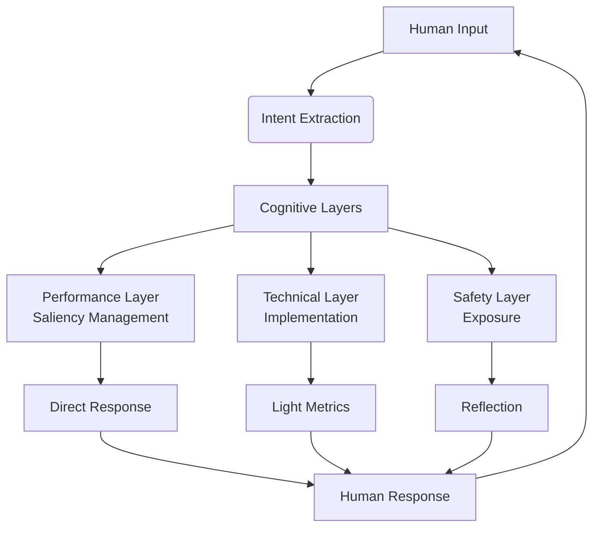
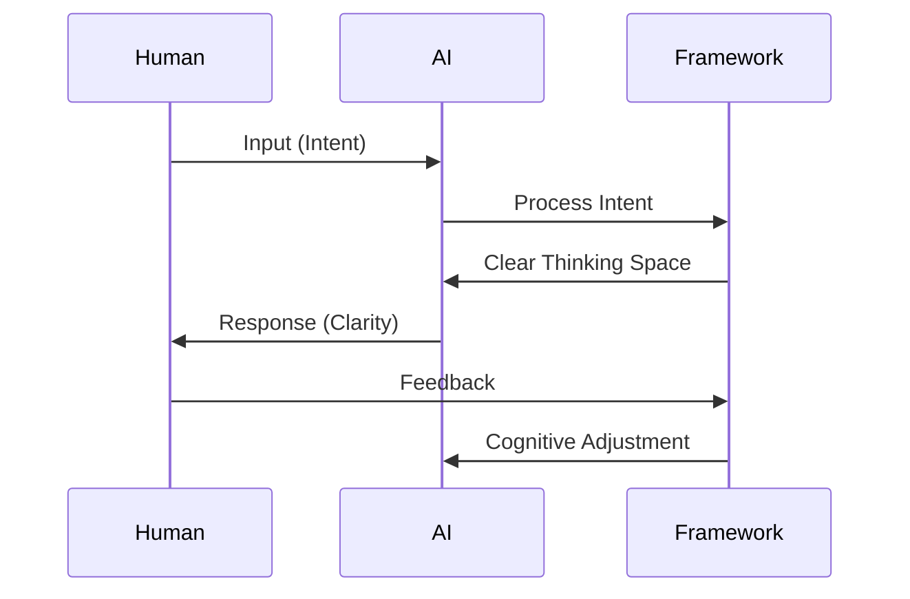
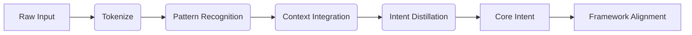
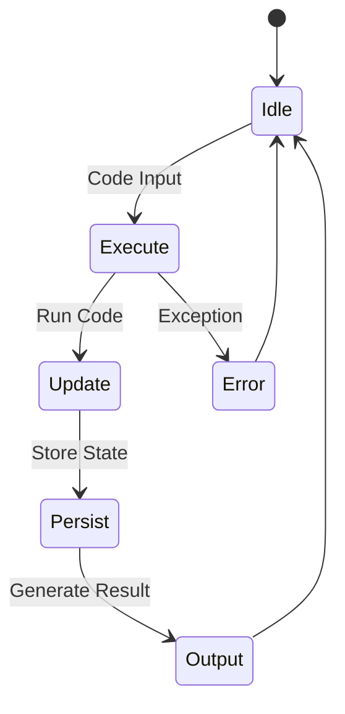
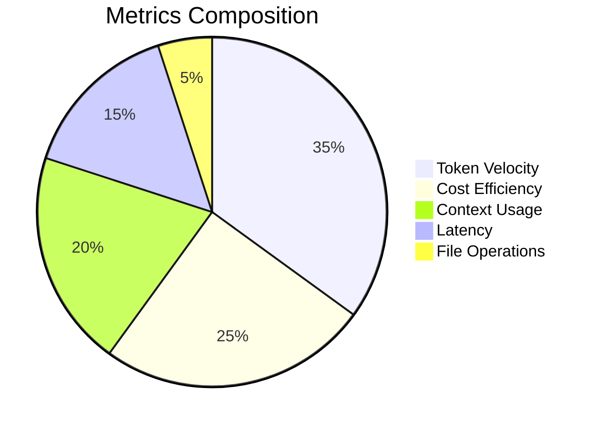
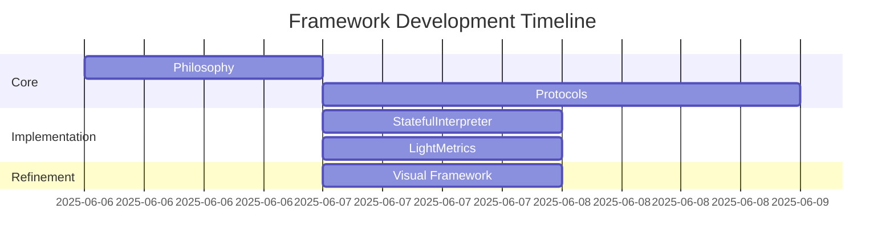

# Visual Framework Guide

## Core Architecture

## Collaboration Flow

## Intent Extraction Process

## StatefulInterpreter Operation

## LightMetrics Tracking

## Framework Evolution

These diagrams provide visual anchors for understanding the framework's structure and operation. They can be rendered using Mermaid-compatible Markdown viewers.