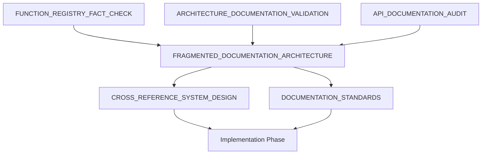

# OpenHCS Documentation Overhaul Analysis
**Comprehensive Analysis and Design for Documentation Modernization**

*Generated: 2025-07-18*  
*Status: ANALYSIS COMPLETE - READY FOR IMPLEMENTATION*

---

## Overview

This directory contains the complete analysis and design documentation for the OpenHCS documentation overhaul project. The analysis revealed critical issues with API documentation while confirming excellent technical architecture documentation.

## Analysis Files

### **Phase 1 & 2: Investigation and Fact-Checking**

**[FUNCTION_REGISTRY_FACT_CHECK.md](FUNCTION_REGISTRY_FACT_CHECK.md)**
- **Purpose**: Verification of function registry claims against actual codebase
- **Key Finding**: 574+ functions claim is VERIFIED and accurate
- **Status**: ✅ COMPLETE - All technical claims validated

**[ARCHITECTURE_DOCUMENTATION_VALIDATION.md](ARCHITECTURE_DOCUMENTATION_VALIDATION.md)**
- **Purpose**: Comprehensive validation of architecture documentation accuracy
- **Key Finding**: 95%+ accuracy rate for technical claims - exceptionally accurate
- **Status**: ✅ COMPLETE - Architecture docs are excellent and should be preserved

**[API_DOCUMENTATION_AUDIT.md](API_DOCUMENTATION_AUDIT.md)**
- **Purpose**: Analysis of existing Sphinx docs + OpenHCS evolution requirements
- **Key Finding**: Existing Sphinx structure is excellent, needs content updates for OpenHCS evolution
- **Status**: ✅ LEVERAGE + EVOLVE STRATEGY - Use TUI script as todo list for updates

### **Phase 3: Architecture Design**

**[FRAGMENTED_DOCUMENTATION_ARCHITECTURE.md](FRAGMENTED_DOCUMENTATION_ARCHITECTURE.md)**
- **Purpose**: Complete design for modular, maintainable documentation structure
- **Key Innovation**: Purpose-driven fragmentation with intelligent cross-referencing
- **Status**: ✅ COMPLETE - Ready for implementation

**[CROSS_REFERENCE_SYSTEM_DESIGN.md](CROSS_REFERENCE_SYSTEM_DESIGN.md)**
- **Purpose**: Intelligent navigation system for fragmented documentation
- **Key Innovation**: Context-aware linking with progressive disclosure
- **Status**: ✅ COMPLETE - Navigation templates designed

**[DOCUMENTATION_STANDARDS.md](DOCUMENTATION_STANDARDS.md)**
- **Purpose**: Comprehensive standards framework to prevent future documentation debt
- **Key Innovation**: Automated quality assurance with CI/CD integration
- **Status**: ✅ COMPLETE - Quality framework established

---

## Key Findings Summary

### **🎯 Key Discoveries**

**1. Three Excellent Documentation Sources Identified**
- **Sphinx structure**: `docs/source/` - Excellent organization, needs content updates
- **Architecture docs**: `docs/architecture/` - Rich OpenHCS content, needs fact-checking
- **TUI script patterns**: Generated script - Real working patterns, comprehensive todo list

**2. Three-Pronged Integration Strategy Required**
- **Architecture content audit**: Extract good parts, remove outdated content
- **Sphinx structure mapping**: Integrate architecture content into Sphinx sections
- **TUI script validation**: Use script as requirements list for complete coverage

### **✅ Strengths Verified**

**1. Technical Implementation**
- Function registry genuinely innovative with 574+ unified functions
- Memory type system sophisticated with automatic GPU conversion
- Architecture documentation exceptionally accurate (95%+ verified)

**2. Existing Documentation Quality**
- `docs/architecture/` directory contains excellent technical content
- Function registry documentation matches implementation exactly
- Memory type system documentation is comprehensive and accurate

---

## Three-Pronged Documentation Strategy

### **📋 Source 1: Sphinx Structure** (`docs/source/`)
- **Strengths**: Excellent organization, cross-references, progressive complexity
- **Needs**: Content updates for OpenHCS evolution, module path fixes
- **Role**: Foundation structure and navigation framework

### **📋 Source 2: Architecture Documentation** (`docs/architecture/`)
- **Strengths**: Rich OpenHCS-specific content, technical depth
- **Needs**: Fact-checking, removal of outdated content
- **Role**: Technical content for integration into Sphinx concepts/

### **📋 Source 3: TUI-Generated Script** (working example)
- **Strengths**: Real working patterns, comprehensive requirements
- **Needs**: Documentation coverage validation
- **Role**: Todo list ensuring all concepts are documented

### **🔄 Integration Process**:
1. **Audit** architecture docs → extract good content
2. **Map** good content → appropriate Sphinx sections
3. **Validate** TUI script → ensure complete coverage
4. **Pattern match** final docs → verify examples follow TUI script patterns

---

## Implementation Roadmap

### **� STARTING POINT: Architecture Content Audit**

**BEGIN HERE** - Immediate first action:

1. **Pick first architecture doc**: `docs/architecture/function-registry-system.md`
   - **Why this one**: Referenced in TUI script, core OpenHCS concept
   - **Action**: Use context engine to fact-check every claim against codebase
   - **Output**: Verified content list ready for Sphinx integration

2. **Create verification template**:
   ```
   ✅ VERIFIED: Content matches codebase exactly
   ⚠️ NEEDS UPDATE: Content partially correct, needs modification
   ❌ REMOVE: Content outdated/hallucinated, delete entirely
   ```

3. **Systematic audit process**:
   - One architecture doc at a time
   - Every technical claim verified against code
   - Create "integration-ready" content list

### **�🚨 CRITICAL (Immediate)**

**1. Architecture Content Audit**
- Extract excellent content from `docs/architecture/` folder
- Fact-check against current codebase using context engine
- Remove outdated/hallucinated content, preserve good parts
- **Files**: All .md files in docs/architecture/

**2. Three-Source Integration Planning**
- Map architecture content to appropriate Sphinx sections
- Plan integration of TUI script patterns into examples
- Design content flow: architecture → Sphinx → TUI validation
- **Strategy**: [API_DOCUMENTATION_AUDIT.md](API_DOCUMENTATION_AUDIT.md) - Three-pronged approach

**3. Sphinx Structure Enhancement**
- Integrate architecture deep-dives into concepts/ sections
- Update API docs with real OpenHCS patterns from TUI script
- Ensure all TUI script concepts are documented somewhere
- **Validation**: Every concept in TUI script must have documentation

### **🟡 HIGH PRIORITY (Next Phase)**

**4. Complete API Documentation Rebuild**
- All modules in `docs/api/` with correct paths
- Comprehensive examples for every major feature
- **Architecture**: [FRAGMENTED_DOCUMENTATION_ARCHITECTURE.md](FRAGMENTED_DOCUMENTATION_ARCHITECTURE.md) - Section: "Tier 2: API Reference Documentation"

**5. Cross-Reference Implementation**
- Navigation templates in all documents
- Bidirectional linking system
- **Design**: [CROSS_REFERENCE_SYSTEM_DESIGN.md](CROSS_REFERENCE_SYSTEM_DESIGN.md) - Section: "Navigation Templates"

### **� CONCRETE 4-WEEK ROADMAP**

**WEEK 1: Architecture Content Audit (TIER 1 - Critical)**
- Day 1: Audit `function-registry-system.md` (core to TUI script imports)
- Day 2: Audit `pipeline-compilation-system.md` (two-phase execution)
- Day 3: Audit `memory-type-system.md` (GPU conversion, backends)
- Day 4: Audit `configuration-management-system.md` (GlobalPipelineConfig)
- Day 5: Audit `tui-system.md` + `vfs-system.md` (primary interface + VFS)
- **Output**: ✅⚠️❌ verification status for 6 critical files

**WEEK 2: Continue Architecture Audit + Planning**
- Day 1-2: Audit TIER 2 files (gpu-resource, special-io, function-patterns, memory-backend, pattern-detection)
- Day 3-4: Map ALL verified content to appropriate Sphinx sections
- Day 5: Plan integration of TUI script patterns into examples
- **Output**: Complete audit of 11 critical files + integration plan

**WEEK 3: Content Integration Execution**
- Day 1-2: Audit remaining TIER 3 & 4 files (12 remaining files)
- Day 3-5: Integrate ALL verified architecture content into Sphinx structure
- **Output**: Complete architecture audit + initial Sphinx integration

**WEEK 4: Pattern Validation & Final Polish**
- Day 1-2: Update all examples to follow TUI script patterns
- Day 3-4: Pattern-match all examples against TUI script requirements
- Day 5: Final verification of all claims against codebase
- **Output**: Complete, accurate documentation covering all 23 architecture files

### **�🟢 MEDIUM PRIORITY (Later)**

**Advanced Features Documentation**
- Complex neuroscience workflows
- Custom function development guides
- Performance optimization documentation

---

## Architecture Innovation

### **Fragmented Documentation Structure**

```
docs/
├── user/           # 🟢 Working examples, 5-min setup
├── api/            # 🔧 Correct imports, complete reference  
├── architecture/   # 🏗️ Keep existing (95% accurate)
└── legacy/         # 📦 Archive broken content
```

### **Quality Assurance Framework**

- **Every code example follows TUI script patterns**
- **Technical claims verified against codebase**
- **Pattern consistency maintained**
- **User experience metrics**

### **Cross-Reference System**

- **Context-aware navigation templates**
- **Progressive learning paths**
- **Bidirectional semantic linking**
- **Automated link validation**

---

## Success Metrics

### **User Experience**
- ✅ New user completes quick start in <5 minutes
- ✅ Zero broken links in critical path documentation
- ✅ All documented imports work without modification
- ✅ User can find relevant information in <3 clicks

### **Technical Quality**
- ✅ 100% of code examples follow TUI script patterns
- ✅ 95%+ technical accuracy maintained against codebase
- ✅ Documentation coverage for all public APIs
- ✅ Zero EZStitcher references in user-facing docs

---

## Next Steps

**Ready to proceed with Phase 4: Content Migration & Creation**

The analysis phase is complete and has provided:
1. **Three-pronged integration strategy** combining Sphinx + architecture + TUI sources
2. **Architecture content audit plan** for extracting good content and removing rot
3. **Comprehensive mapping strategy** for integrating content into Sphinx structure
4. **TUI script validation framework** ensuring complete documentation coverage

**Implementation can begin immediately using the three-pronged approach: audit architecture docs → integrate into Sphinx → pattern-match against TUI script (code is sole source of truth, no execution needed).**

---

## File Dependencies



**All analysis files are interconnected and should be referenced together during implementation.**
