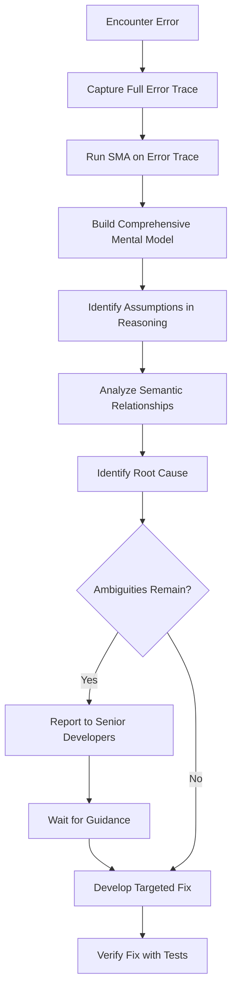

# Error Analysis with Semantic Matrix Analyzer

## Overview

This document outlines the recommended approach for analyzing and resolving errors in the OpenHCS codebase using the Semantic Matrix Analyzer (SMA) tool.

## Core Principles of SMA Error Trace Processing

1. **Comprehensive Mental Model**: Use SMA extensively to build a complete mental model of the codebase
2. **Assumption Identification**: Leverage SMA to identify and resolve any assumptions in reasoning that could lead to fatal errors
3. **Ambiguity Reporting**: Report to senior developers when encountering ambiguities that need clarification
4. **Guided Resolution**: Wait for guidance before proceeding when faced with critical uncertainties
5. **Error Trace Analysis First**: Always analyze error traces with SMA before attempting fixes
6. **Semantic Understanding**: Focus on understanding the semantic relationships between components in the error stack
7. **Root Cause Identification**: Use SMA to identify the root cause by analyzing intent and dependencies
8. **Targeted Fixes**: Make precise, targeted fixes based on comprehensive analysis

## Workflow



## Highlighted Approach

> **⭐ BEST PRACTICE: SMA ERROR ANALYSIS ⭐**
>
> When encountering errors, ALWAYS run the Semantic Matrix Analyzer on the error trace before making any changes:
>
> ```bash
> python -m semantic_matrix_analyzer.intent.cli --input-text "$(error_trace)" --format markdown
> ```
>
> This analysis will:
> 1. Build a comprehensive mental model of the relevant code paths
> 2. Identify potentially fatal assumptions in your reasoning
> 3. Reveal semantic relationships between components in the error stack
> 4. Help understand the root cause for targeted fixes
>
> When ambiguities remain after SMA analysis, report them to senior developers and wait for guidance before proceeding with critical changes.

## Example Usage

### Step 1: Capture the Error Trace

When an error occurs, capture the full error trace:

```python
try:
    # Code that produces error
except Exception as e:
    error_trace = traceback.format_exc()
    with open("error_trace.txt", "w") as f:
        f.write(error_trace)
```

### Step 2: Analyze with SMA

Run the Semantic Matrix Analyzer on the error trace:

```bash
python -m semantic_matrix_analyzer.intent.cli --input-file error_trace.txt --format markdown
```

### Step 3: Interpret Results

The SMA output will show:
- Semantic relationships between components in the error stack
- Intent mismatches that may be causing the error
- Dependency chains that need to be addressed
- Potential architectural violations

### Step 4: Make Targeted Fixes

Based on the SMA analysis, make precise, targeted fixes that address the root cause rather than symptoms.

## Benefits

- **Reduced Iterations**: Fewer trial-and-error attempts to fix issues
- **Deeper Understanding**: Better comprehension of the codebase's architecture
- **More Robust Fixes**: Solutions that address root causes, not just symptoms
- **Architectural Consistency**: Changes that maintain the codebase's design principles

## Integration with Development Workflow

Integrate SMA error analysis into your development workflow:

1. **CI/CD Pipeline**: Automatically run SMA on test failures
2. **Code Review**: Include SMA analysis results in pull requests
3. **Documentation**: Reference SMA findings in commit messages and issue reports
4. **Knowledge Sharing**: Use SMA visualizations to explain complex errors to team members

## Conclusion

Using the Semantic Matrix Analyzer for error analysis is a powerful approach that leads to more efficient debugging, better understanding of the codebase, and more robust solutions. Make it a standard part of your development workflow to improve code quality and reduce debugging time.
