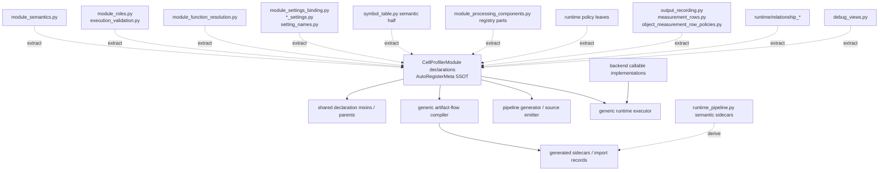

# CellProfiler Declaration Extraction Shadow Plan

Date: 2026-06-26

Purpose: plan the non-destructive extraction pass before moving CellProfiler
module semantics into AutoRegisterMeta-backed `CellProfilerModule`
declarations.

This is a planning artifact, not a production-code design layer. The extraction
pass should make shadow copies outside import paths, rewrite those copies into
the desired declaration shape, and use the diffs to identify exactly what moves
onto module classes, what becomes inherited declaration mixins, and what remains
generic infrastructure.

## Rule

```text
Copy first. Rewrite the copy. Diff the copy. Then migrate production code.
```

- Do not overwrite production files during extraction.
- Do not create compatibility shims to preserve old semantic owners.
- Do not introduce a new declaration facade or parallel registry.
- AutoRegisterMeta registries are acceptable only when they are the single
  registry for one semantic family.
- Module-specific facts land on `CellProfilerModule` declarations or inherited
  declaration mixins.
- Generic infrastructure parses, lowers, validates, serializes, executes, or
  materializes facts declared elsewhere.

## Shadow Workspace

Use one non-imported markdown file per source group:

```text
docs/plans/cellprofiler_declaration_shadow/
  00_index.md
  01_module_semantics_shadow.md
  02_infrastructure_roles_shadow.md
  03_function_resolution_shadow.md
  04_settings_binding_shadow.md
  05_artifact_flow_shadow.md
  06_processing_components_shadow.md
  07_runtime_policy_shadow.md
  08_measurement_rows_shadow.md
  09_relationships_shadow.md
  10_debug_views_shadow.md
  11_runtime_pipeline_sidecars_shadow.md
```

Each shadow file should contain:

```text
Current owner:
Current facts:
Declaration-shaped copy:
Candidate module attrs:
Candidate mixins / parents:
Generic code that stays:
Production callers to rewire:
Deletion/prune conditions:
Focused tests:
NRA selector ideas:
```

The shadow files can include fenced Python sketches, but they must not be placed
under `openhcs/` or imported by production code.

## NominalRefactorAdvisor DSL Leverage

Use the NominalRefactorAdvisor codemod DSL as batch-edit and verification
tooling, not as a semantic oracle. It can select source, scaffold mechanical
rewrites, simulate diffs, validate parsing, and enforce architecture guards.
It must not infer CellProfiler-specific declarations that need domain/codebase
judgment.

Useful DSL surfaces for this migration:

- `source_index_target`: select classes, methods, functions, and assignments by
  file, qualname, node kind, or regex.
- `class_family_target` and `inheritance_edge_target`: select declaration
  families and mixin edges when moving behavior onto `CellProfilerModule`
  subclasses.
- `call_site_target`: select generator/compiler/runtime methods that call old
  semantic owners.
- `target_set_expression`: compose include/require/exclude selectors so batches
  are precise instead of broad regex rewrites.
- `apply_selected_targets` and `delete_selected_targets`: run one operation
  template over many selected targets with `selection_count` contracts.
- `move_symbol_to_module` and `move_symbols_to_module`: move top-level helper
  classes/functions once the target declaration boundary is clear.
- `add_class_base`, `remove_class_base`, `delete_class_assignment`,
  `delete_module_assignments`, `replace_function_signature`,
  `replace_function_body`, `replace_text`, `ensure_import`, and
  `remove_import_names`: mechanical edit primitives for constrained batches.
- simulation parse validation: require `parse_valid=true` before applying any
  generated batch.
- architecture guards: forbid reintroduction of old owners, module-name
  dispatch tables, or calls that bypass `CellProfilerModule` declarations.

Recommended NRA pass shape for each source group:

1. Emit a source index for the group and resolve selectors for the exact owner
   rows/classes/functions involved.
2. Use `--codemod-target-source` or selected-operation scaffolds to build the
   shadow copy, then inspect the diff by hand.
3. Convert only obvious mechanical moves into a codemod plan with explicit
   `selection_count` expectations.
4. Run `--codemod-simulate --json` and require parse validation before apply.
5. Add architecture guard rules for the migrated family before broadening the
   batch.

Starter command shape:

```bash
cd /home/ts/code/projects/nominal-refactor-advisor
. .venv/bin/activate
python -m nominal_refactor_advisor \
  /home/ts/code/projects/openhcs-benchmark-platform/openhcs/interop/cellprofiler/module_function_resolution.py \
  /home/ts/code/projects/openhcs-benchmark-platform/openhcs/processing/backends/cellprofiler/module_classes.py \
  --no-auto-context-root \
  --codemod-source-index \
  --json
```

Per-group leverage:

| Group | NRA leverage | Use it for | Do not use it for |
| --- | --- | --- | --- |
| `module_semantics.py` | High | select table assignments, scaffold class attrs/mixins, guard old table reads | deciding category/dimensionality truth |
| `module_roles.py`, `execution_validation.py` | Medium | select role/export helpers and call sites, scaffold declaration query rewrites | deciding retained-artifact semantics |
| `module_function_resolution.py` | High | move or delete strategy leaves, add declaration bases/attrs, replace generator call sites, guard module-name dispatch | inventing function variants from names alone |
| `module_settings_binding.py`, `*_settings.py`, `setting_names.py` | High | move uppercase setting constants and simple binding maps into declarations, delete old assignments, normalize imports | designing typed lowering semantics |
| `symbol_table.py` semantic half | Medium | inventory `ModuleContractBuilder` owners/callers, scaffold simple hook moves, guard old semantic access | replacing artifact-flow compiler design |
| `module_processing_components.py` | Medium | find module-specific component rules and `source_identity_*` call sites, enforce guards | deriving stack/group axis algebra without code review |
| runtime policy files | Medium-high | select policy leaves, move reusable policy classes, replace scattered `for_module` calls | duplicating runtime plans outside declarations |
| measurement row and relationship files | Medium | select row/endpoint policy families and move shared leaves after shadow review | guessing row ownership or feature naming |
| `debug_views.py` | High | convert module-name debug families to declaration attrs/mixins | changing renderer mechanics |
| `runtime_pipeline.py` sidecars | Medium | guard generated semantic sidecars and replace old-owner calls | deciding persistence compatibility policy |

## Ownership Graph



## Group Plans

### 1. Module Semantics

Current owner:

- `openhcs/interop/cellprofiler/module_semantics.py`

Declaration-owned facts:

- category;
- dimensionality support;
- mask support;
- infrastructure role.

Shadow rewrite:

- Copy the table into declaration-shaped rows grouped by target
  `CellProfilerModule` class.
- Collapse repeated combinations into candidate mixins such as
  `ImageOperationModule`, `ObjectOperationModule`, `MeasurementModule`,
  `InfrastructureModule`, `MaskSupportingModule`, or volumetric-capability
  traits only where repetition is real.

Generic code that stays:

- lookup helpers that simply query `CellProfilerModule.for_module(...)`;
- display/report formatting of derived declaration data.

Diff questions:

- Which fields already exist on `CellProfilerModule` and only need population?
- Which rows are category inference fallbacks rather than true module facts?
- Which semantics belong to backend callable implementation rather than CP
  module declaration?

Migration gate:

- no production caller reads the original semantic table for a module fact;
- derived catalog output is unchanged for representative modules.

### 2. Infrastructure Roles And Export Validation

Current owners:

- `openhcs/interop/cellprofiler/module_roles.py`
- `openhcs/interop/cellprofiler/execution_validation.py`

Declaration-owned facts:

- infrastructure role;
- import note;
- retained artifact behavior;
- export/materialization capability;
- post-execution export requirements.

Shadow rewrite:

- Copy `LoadData`, `SaveImages`, `ExportToSpreadsheet`, and
  `ExportToDatabase` behavior into declaration-shaped infrastructure traits.
- Model retained artifact behavior as a declaration query, not generator pruning
  code.

Generic code that stays:

- export execution and file-writing mechanics;
- validation traversal over an already-declared pipeline plan;
- artifact materialization mechanics.

Diff questions:

- Can `CellProfilerInfrastructureImportNote` absorb retained artifacts cleanly?
- Does export validation need only declaration capabilities, or does it own real
  execution mechanics?

Migration gate:

- skipped infrastructure module handling uses declaration queries;
- no generator-local `SaveImages` artifact retention branch remains.

### 3. Function Resolution

Current owner:

- `openhcs/interop/cellprofiler/module_function_resolution.py`

Declaration-owned facts:

- `function_name`;
- `function_variants`;
- aliases;
- scoped image/object variants;
- volumetric variants;
- setting-derived variant hooks.

Shadow rewrite:

- Copy each strategy leaf into the matching `CellProfilerModule` declaration
  shape.
- Prefer a default signature/declaration path for the common case.
- Keep only generic helpers for reading settings and returning a
  `ResolvedModuleFunction`.

Generic code that stays:

- setting value readers;
- typed scope parsing;
- backend callable lookup mechanics.

Diff questions:

- Which modules need a direct `resolve_function(...)` override?
- Which modules can share mixins such as `ScopedMeasurementFunctionVariant` or
  `VolumetricSettingFunctionVariant`?
- Which variant facts are already present as `function_variants`?

Migration gate:

- `pipeline_generator.py` calls `CellProfilerModule.resolve_function(...)`;
- no module-name keyed function-resolution registry remains as an authority;
- focused function-resolution tests pass.

### 4. Settings Binding

Current owners:

- `openhcs/interop/cellprofiler/module_settings_binding.py`
- `openhcs/interop/cellprofiler/*_settings.py`
- relevant parts of `openhcs/interop/cellprofiler/setting_names.py`

Declaration-owned facts:

- CP setting labels;
- setting aliases;
- ignored settings;
- unsupported settings;
- defaults;
- setting-to-parameter bindings;
- module-local postprocess hooks;
- typed setting domains where they are CP module facts.

Shadow rewrite:

- Copy each binding strategy into a declaration-shaped section for the matching
  module class.
- Separate reusable parsing helpers/enums from module-owned labels and defaults.
- Normalize uppercase setting constants into class attrs or inherited mixin
  attrs when they are semantic facts.

Generic code that stays:

- `SettingsBinder` parsing mechanics;
- reusable parsers;
- neutral enum coercion helpers;
- coverage reporting over declaration-owned bindings.

Diff questions:

- Which `_settings.py` files become empty after module facts move?
- Which parsers/enums are reusable implementation types and should remain?
- Which binding overrides can become `postprocess_bound_settings(...)`?

Migration gate:

- adding a CP setting binding happens on the module declaration or an inherited
  declaration mixin;
- `SettingsBinder` has no module-specific policy table;
- setting coverage tests compare declaration-derived coverage.

### 5. Artifact Flow And Symbol Semantics

Current owner:

- semantic half of `openhcs/interop/cellprofiler/symbol_table.py`

Declaration-owned facts:

- required inputs;
- declared outputs;
- sidecars;
- measurement outputs;
- relationship outputs;
- retained artifacts;
- source-bound artifact roles.

Shadow rewrite:

- Copy each `ModuleContractBuilder`/pattern into declaration-shaped
  `require(...)`, `declare(...)`, `declare_measurements(...)`, and
  `declare_relationships(...)` hooks.
- Keep a separate generic compiler sketch for producer lookup and source-schema
  resolution.

Generic code that stays:

- ordered pipeline environment;
- prior producer lookup;
- source schema lookup;
- source binding attachment;
- producer/source provenance records;
- runtime `ModuleArtifactContract` assembly.

Diff questions:

- Which builder facts are common inherited patterns?
- Which fallback inference is safe as generic convention?
- Which sidecar data is only debug/provenance and not runtime contract?

Migration gate:

- generic artifact-flow compiler queries module declarations;
- `CellProfilerSymbol*` types are no longer production semantic owners;
- generated sidecars serialize compiler/declaration results only if still
  needed.

### 6. Processing Components

Current owner:

- registry parts of `openhcs/interop/cellprofiler/module_processing_components.py`

Declaration-owned facts:

- `variable_components`;
- `group_by`;
- pairwise object-domain requirements;
- category-derived execution-axis overrides;
- module-specific source-lineage behavior.

Shadow rewrite:

- Copy module-name/category strategy rows into module declaration attrs or
  processing traits.
- Preserve generic axis algebra as infrastructure.

Generic code that stays:

- source-axis algebra;
- request/result dataclasses;
- lineage traversal;
- source-binding serialization;
- default lowering for conventional modules.

Diff questions:

- Which category rules are truly module facts versus generic defaults?
- Which modules enforce a specific variable component?
- Which logic depends on actual artifact lineage and should stay generic?

Migration gate:

- generator asks `CellProfilerModule.processing_components(...)`;
- `variable_components` and `group_by` remain the only authored stack/fanout
  semantics;
- no new source identity stack declaration is introduced.

### 7. Runtime Policy Selection

Current owners:

- `openhcs/interop/cellprofiler/runtime/policy_registry.py`
- runtime policy leaves in `runtime/module_execution.py` and related runtime
  policy files.

Declaration-owned facts:

- execution mode;
- primary domain;
- object input roles;
- special input roles;
- runtime kwargs;
- measurement cardinality;
- output provenance/main-flow policy selection.

Shadow rewrite:

- Copy module-name policy leaves into declaration-selected policy attrs or
  inherited runtime traits.
- Keep AutoRegisterMeta policy families only when they are the single mechanic
  family for that role.

Generic code that stays:

- runtime request objects;
- runtime plan construction;
- policy execution mechanics;
- cache/profiling;
- image/object/measurement payload plumbing.

Diff questions:

- Which policy families are real mechanic families and should remain?
- Which leaves become empty once selected from declarations?
- Which runtime lookups are duplicated and can be selected once in the module
  runtime plan?

Migration gate:

- `CellProfilerModuleRuntimePlan` consumes selected declaration policies;
- no scattered `*.for_module(module_name)` calls remain in runtime planning;
- runtime tests cover image/object/special-input modules.

### 8. Measurement Rows

Current owners:

- `openhcs/interop/cellprofiler/runtime/output_recording.py`
- `openhcs/interop/cellprofiler/runtime/measurement_rows.py`
- `openhcs/interop/cellprofiler/runtime/object_measurement_row_policies.py`

Declaration-owned facts:

- row schemas;
- feature naming templates;
- row ownership;
- source qualification;
- dense/sparse object row domain;
- module-specific diagnostic rows.

Shadow rewrite:

- Copy row builders/policies into declaration-shaped measurement traits.
- Factor shared row families before moving leaves.

Generic code that stays:

- materializing rows into runtime artifacts;
- image-number/source-path projection;
- CSV/table assembly;
- row iteration mechanics.

Diff questions:

- Which measurement modules share row-domain policies?
- Which features are backend output schema versus CP module row semantics?
- Which row source rules are generic provenance mechanics?

Migration gate:

- output recording asks declaration-selected row policies;
- row materialization remains generic;
- measurement row tests still cover representative image/object/relationship
  modules.

### 9. Relationships

Current owners:

- `openhcs/interop/cellprofiler/runtime/relationship_endpoints.py`
- `openhcs/interop/cellprofiler/runtime/relationship_measurement_rows.py`
- relationship-related pieces of output recording and object-label measurement
  runtime.

Declaration-owned facts:

- parent/child endpoints;
- distance output semantics;
- child-count and parent-ID feature families;
- relationship row ownership;
- relationship slice/source projection policy.

Shadow rewrite:

- Copy `RelateObjects`, identify-secondary/tertiary, and tracking relationship
  facts into declaration-shaped relationship traits.
- Make the relationship endpoint declaration the SSOT queried by row builders,
  output recording, and export paths.

Generic code that stays:

- relationship artifact storage;
- pair iteration;
- per-slice projection mechanics;
- source/provenance projection mechanics.

Diff questions:

- Which endpoint fallbacks are generic safety nets versus module facts?
- Which distance rows are exclusively `RelateObjects` semantics?
- Which parent/child count rows are shared identify-object semantics?

Migration gate:

- relationship endpoint and distance facts have one declaration owner;
- no adapter/export/runtime helper duplicates endpoint semantics.

### 10. Debug Views

Current owner:

- `openhcs/interop/cellprofiler/debug_views.py`

Declaration-owned facts:

- debug section family;
- specialized renderer selection;
- module-specific debug title/section choices.

Shadow rewrite:

- Copy table-driven module-name lists into debug traits on module declarations.
- Keep debug view rendering as a read model over declarations.

Generic code that stays:

- `DebugViewModel` construction;
- table rendering;
- default section factories;
- generic artifact/projection tables.

Diff questions:

- Which section families correspond to existing module categories?
- Which specialized renderers are truly module-specific?

Migration gate:

- debug rendering queries the module declaration for its debug section family;
- no debug registry owns module-name semantics in parallel.

### 11. Runtime Pipeline Sidecars

Current owner:

- `openhcs/interop/cellprofiler/runtime_pipeline.py`
- generated semantic sidecar plumbing in `runtime/generated_pipeline.py`

Declaration-owned or compiler-derived facts:

- module roles;
- runtime artifact contracts;
- semantic contract fingerprint inputs;
- generated sidecar content if persistence remains necessary.

Shadow rewrite:

- Copy sidecar fields into a serializer sketch whose inputs are declaration
  facts and generic artifact-flow compiler results.
- Remove any authored module-name lists from the shadow shape.

Generic code that stays:

- generated module materialization;
- import/reload mechanics;
- fingerprinting over explicit compiler output;
- old-sidecar migration shim if absolutely required.

Diff questions:

- Which persisted fields are runtime-required?
- Which fields are debug-only and can become import-record data?
- Which legacy generated artifacts need a migration reader versus regeneration?

Migration gate:

- generated sidecars do not author module semantics;
- infrastructure membership comes from module declarations;
- runtime consumes core `ModuleArtifactContract` plus derived provenance.

## Recommended Order

1. `module_semantics.py`
2. `module_function_resolution.py`
3. `module_settings_binding.py` and `_settings.py`
4. `module_roles.py` / `execution_validation.py`
5. `symbol_table.py` semantic half
6. `module_processing_components.py`
7. runtime policy selection
8. measurement rows
9. relationships
10. debug views
11. runtime pipeline sidecars

The first pass should produce shadow docs and diffs only. Production migration
starts after the shadow diff shows the declaration landing zone and generic
infrastructure boundary for that group.

## Verification Per Group

- Run the old-owner grep after each migration and require only generic
  infrastructure remains.
- Run focused tests for the moved semantic family.
- Run NominalRefactorAdvisor simulation before broad mechanical edits.
- Check that no new module-name keyed table, compatibility shim, or generated
  metadata mirror became the source of truth.
