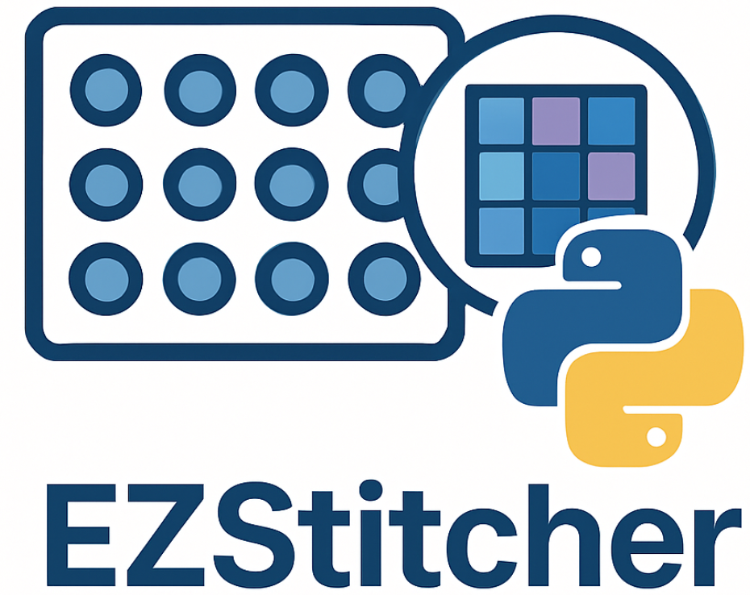

Welcome to EZStitcher's Documentation
=====================================

EZStitcher is a Python package for stitching microscopy images with support for Z-stacks, multi-channel fluorescence, and advanced focus detection.

Getting Started Quickly
--------------------

The fastest way to get started with EZStitcher is to use ``stitch_plate``:

.. code-block:: python

    from ezstitcher import stitch_plate

    # Stitch a plate with a single function call
    stitch_plate("path/to/microscopy/data")

For a complete guide including installation and examples, see :doc:`getting_started/getting_started`.

Key Features
------------

- **Simplified Interface for Non-Coders**: Process and stitch images with minimal code using stitch_plate
- **Multi-channel fluorescence support**: Process and stitch multiple fluorescence channels
- **Z-stack handling**: Process 3D image stacks with various projection methods
- **Advanced focus detection**: Find the best focused plane in Z-stacks
- **Flexible preprocessing**: Apply custom preprocessing to images
- **Multiple microscope support**: Works with ImageXpress and Opera Phenix microscopes
- **Automatic detection**: Automatically detect microscope type and image organization
- **Object-oriented API**: Clean, modular design for easy customization

Key Resources
-----------

* :doc:`getting_started/getting_started` - Install EZStitcher and run your first pipeline in minutes
* :doc:`user_guide/basic_usage` - Learn about the simplified interface for non-coders
* :doc:`concepts/architecture_overview` - Learn about EZStitcher's architecture
* :doc:`user_guide/intermediate_usage` - Create custom pipelines with steps
* :doc:`user_guide/best_practices` - Learn best practices for using EZStitcher

.. toctree::
   :maxdepth: 2
   :caption: Getting Started

   getting_started/getting_started

.. toctree::
   :maxdepth: 2
   :caption: User Guide

   user_guide/introduction
   user_guide/basic_usage
   user_guide/intermediate_usage
   user_guide/advanced_usage
   user_guide/best_practices
   user_guide/integration

.. toctree::
   :maxdepth: 2
   :caption: Core Concepts

   concepts/basic_microscopy
   concepts/architecture_overview
   concepts/pipeline_orchestrator
   concepts/pipeline
   concepts/pipeline_factory
   concepts/step
   concepts/function_handling
   concepts/processing_context
   concepts/directory_structure

.. toctree::
   :maxdepth: 2
   :caption: API Reference

   api/index

.. toctree::
   :maxdepth: 2
   :caption: Development

   development/index

.. toctree::
   :maxdepth: 2
   :caption: Appendices

   appendices/index

Indices and tables
==================

* :ref:`genindex`
* :ref:`modindex`
* :ref:`search`
