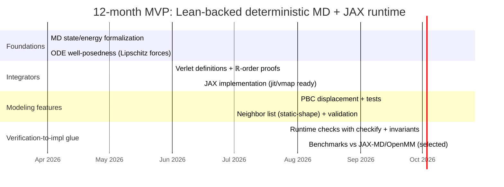
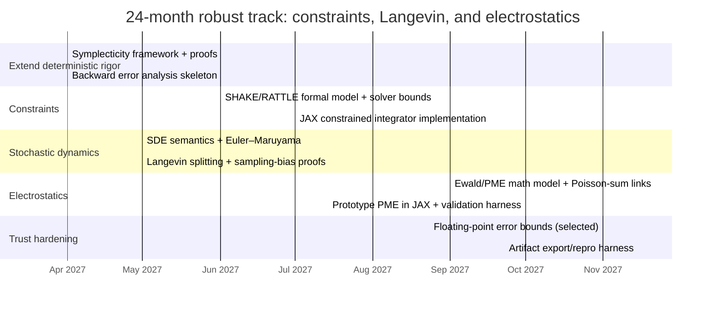

# Verified Lean-to-JAX Molecular Dynamics for Molecular Docking

## Executive summary

A feasible path to “Lean-backed” molecular dynamics (MD) for a **Python/JAX** docking-oriented simulation is to treat Lean as the *mathematical specification + proof engine* for (i) the continuous-time dynamics (ODE/SDE semantics), (ii) the discrete-time integrators (structure-preserving properties, convergence, and sampling bias), and (iii) the key modeling abstractions (potentials/forces, boundary conditions, constraints), while implementing the *runtime* in JAX using a deliberately restricted, “compiler-friendly” functional style (pure functions, static-shape data structures, explicit PRNG keys). This aligns with how JAX transformations (`jit`, `vmap`, `grad`) are designed to work—on pure, traceable Python functions that lower to XLA. citeturn7search0turn7search5turn7search4turn15search14

mathlib4 already provides strong foundations in analysis, measure theory, probability, ODE existence/uniqueness bounds, manifolds/vector fields, and Fourier analysis (including Poisson summation—relevant to Ewald/PME-style reasoning). citeturn0search0turn2search2turn9search4turn13search4turn14search0 However, MD-specific theory is not “off the shelf”: canonical Hamiltonian mechanics on symplectic manifolds, symplectic integrator libraries (e.g., Störmer–Verlet proofs), stochastic calculus for Langevin SDEs, and realistic force-field engineering constructs (constraints, PME, neighbor lists, cutoff switching) largely remain to be formalized or tightly integrated. A concrete signal of the gap is that even foundational algebraic infrastructure for Poisson algebras is noted as “not yet defined” in mathlib, despite having Lie/symplectic linear algebra components. citeturn13search6turn2search0turn13search3

For implementation, a full verified compiler chain to Python/JAX is not currently a standard Lean workflow: Lean 4 compiles to C as a backend artifact (native code via a C compiler), not to Python. citeturn0search3turn0search19 Therefore, the most credible trust story for a Python/JAX target is: (1) **Lean proofs** establish theorems about a *reference algorithm/DSL semantics*; (2) **JAX code** is either (a) generated from that DSL or (b) manually written but accompanied by proof-carrying specs + runtime checks; and (3) an aggressive **testing/validation harness** continuously checks semantic equivalence (within numeric tolerances) and invariant properties (energy behavior, constraint satisfaction, equilibrium statistics). JAX’s own facilities such as `checkify` (JIT-able runtime checks) help reduce the “silent failure” surface in compiled execution. citeturn7search19turn7search0turn15search2

Two realistic project tracks emerge for a 12–24 month effort (no specific constraint on team size/hardware):  
- **12-month MVP:** deterministic MD core (pair potentials + bonded terms), velocity/position Verlet family, periodic boundary conditions (PBC), neighbor lists with static-shape discipline, and a Lean proof package for (local) well-posedness + basic integrator properties and order-of-accuracy in ℝ.  
- **24-month robust track:** constraints (SHAKE/RATTLE), Langevin integrators with weak/strong convergence targets, thermostat/invariant-measure arguments, and long-range electrostatics (PME) with supporting Fourier/Poisson-summation reasoning; plus an improved trust chain (proof-producing code generation, floating-point error bounds, and versioned artifact export). citeturn5search5turn5search6turn6search7turn13search4turn15search3

## mathlib4 readiness for MD foundations

### Analysis, topology, and linear algebra

mathlib4 provides broad and deep coverage of classical analysis and topology, intended as a general-purpose research library. citeturn2search11turn14search9turn9search16 For MD, the most directly reusable components are:
- **Differentiation/calc infrastructure** for defining potentials \(U(q)\), forces \(F(q) = -\nabla U(q)\), and smoothness/Lipschitz conditions used in well-posedness and stability arguments. citeturn9search3  
- **Finite-dimensional linear algebra and matrices**, including explicit support for the **symplectic group** and related linear symplectic structures (useful for the linear-algebraic layer of symplectic geometry and for canonical forms). citeturn2search0turn13search3

A key gap for “Hamiltonian mechanics as usually presented” is that MD tends to be phrased in terms of symplectic manifolds, Poisson brackets, and Hamiltonian vector fields. mathlib includes differential geometry building blocks (manifolds, tangent bundles, vector fields and Lie brackets), which are prerequisites for Hamiltonian flows on manifolds. citeturn9search1turn12search16turn14search0 But the library explicitly flags that **Poisson algebras are not yet defined**, which is directly on the critical path for a clean Poisson-bracket formulation of Hamiltonian dynamics. citeturn13search6

### Measure theory and probability theory

mathlib4’s measure theory is mature enough to express the kinds of integrals and expectations that appear in equilibrium-statistics and sampling arguments (e.g., Gibbs measures, expectations of observables, Fubini/Tonelli manipulations). For example, it has formalized results like Fubini’s theorem for product measures (representative of the sophistication of the integration framework). citeturn9search4turn9search17

Its probability layer supports modern abstractions such as **Markov kernels**—a natural tool for formalizing stochastic transition operators and (ultimately) Markov-chain properties of stochastic integrators. citeturn0search2turn0search6turn0search10 It also includes material on martingales and optional stopping, indicating nontrivial stochastic-process infrastructure. citeturn9search2turn9search15  
That said, “MD-grade” Langevin/SDE proofs typically require Itô calculus, generators/Fokker–Planck operators, and numerical SDE convergence theory; these are not evidently packaged as a ready-made SDE toolkit in mathlib4, so expect substantial new formalization work on top of current probability foundations. citeturn9search2turn0search10turn9search15

### ODEs, flows, and manifolds

MD’s deterministic core is an ODE:
\[
\dot q = M^{-1}p,\quad \dot p = -\nabla U(q)
\]
or a second-order ODE in \(q\). mathlib4 has an ODE existence/uniqueness backbone via Picard–Lindelöf and supporting inequalities like Grönwall (central in continuous dependence and stability estimates). citeturn0search0turn2search2turn2search6

For manifold-based formulations, mathlib4 includes **integral curves of vector fields on manifolds**, formalizing the definition and infrastructure needed to talk about flows geometrically. citeturn14search0 A very recent formalization effort (“Integral Curves and Flows on Banach Manifolds in Lean”) reports building on mathlib’s Picard–Lindelöf/Grönwall results and then transferring to Banach manifolds—highly relevant if you want Hamiltonian dynamics beyond \(\mathbb{R}^{3N}\). citeturn14search1

### Fourier analysis building blocks relevant to PME/Ewald

Long-range electrostatics in periodic systems often uses Ewald/PME, which mixes real-space short-range terms with reciprocal-space Fourier transforms and is closely related to Poisson summation ideas. mathlib4 includes a formalized **Poisson summation** lemma and also applies Poisson summation to Gaussians in dedicated modules. citeturn13search4turn13search5 This does not give PME “for free,” but it is unusually aligned with the mathematical structure of Ewald-type derivations compared to most general-purpose proof-assistant libraries.

## Existing mechanized proofs adjacent to MD

### What exists in Lean/mathlib that transfers to MD

There is strong evidence that the *mathematical prerequisites* for MD can be mechanized in Lean:
- ODE well-posedness and stability estimates (Picard–Lindelöf, Grönwall) are already in mathlib4. citeturn0search0turn2search2  
- Manifold vector-field infrastructure and integral curves exist and are actively extended in recent work. citeturn14search0turn14search1  
- Probability constructs needed to phrase Markov transition kernels (for stochastic thermostats/integrators) exist. citeturn0search2turn0search10

In addition, a directly “chemistry-adjacent” mechanization effort exists: *Formalizing chemical physics using the Lean theorem prover* (Bobbin, 2023) demonstrates formal derivations for adsorption theories and indicates how physics/chemistry quantities (including Lennard–Jones-related modeling ingredients) can be encoded in Lean with explicit side conditions that are often glossed over in informal derivations. citeturn4search3turn4search9 This is not MD dynamics/integrators, but it is a valuable proof-engineering precedent for handling domain assumptions, partial functions, and scientific-model constraints.

### What is not yet “standard library” material for MD

MD-relevant numerical integrator theory (e.g., symplecticity proofs for Störmer–Verlet, backward error analysis, invariant-measure results for Langevin discretizations) is well-developed mathematically but does not appear as an established Lean/mathlib package; expect to formalize these essentially from scratch (though heavily reusing analysis/ODE/probability foundations). For instance, educational/primary sources describe that Störmer–Verlet is symplectic (and can be derived as a composition of symplectic Euler steps). citeturn4search10turn4search14 Turning that into reusable Lean theorems requires a formal definition of symplectic maps on phase space, the discrete method map \(\Phi_h\), and proofs that \(\Phi_h^\* \omega = \omega\) (or an equivalent Jacobian condition), as described in geometric integration references. citeturn4search14turn11search7turn11search10

Similarly, stochastic thermostats often rely on Langevin dynamics and properties of SDEs; numerical SDE convergence is typically split into **strong** and **weak** convergence criteria, with Euler–Maruyama having strong order \(1/2\) and weak order \(1\) under standard assumptions. citeturn11search15turn11search8turn11search0 A Lean formalization would need (at minimum) measure-theoretic probability plus an SDE semantics layer, which is a major extension beyond the current “kernel/martingale” foundation. citeturn0search2turn9search2turn9search15

## Concrete gaps to formalize for realistic MD and docking

This section itemizes MD features that matter for docking-oriented simulations and identifies what must be formalized (and where mathlib4 helps).

### Force fields and potential energy surfaces

In practice, MD uses composite potentials: bonded terms, nonbonded Lennard–Jones + Coulombic terms, restraints, and sometimes learned potentials. Libraries like JAX-MD and OpenMM expose these modeling components as programmable energy functions and parameterized force field formats. citeturn10search0turn10search1

**Formalization gaps (Lean side):**
- A typed, reusable representation of multi-term potentials \(U(q)\) over \(q \in \mathbb{R}^{3N}\) (or manifolds), with smoothness/coercivity assumptions stated explicitly. Reuse mathlib’s derivative infrastructure for gradients and Lipschitz proofs. citeturn9search3turn0search0  
- A clean bridge between “force = negative gradient” and discrete pairwise sums, including symmetry assumptions and cutoff/switching functions (often piecewise-defined, with differentiability constraints).

**Implementation linkage (JAX side):**
- JAX-MD’s energy APIs are already aligned with “energy-first + autodiff” design (e.g., Lennard–Jones energy wrappers return callables). citeturn10search0turn1search5

### Periodic boundary conditions and cutoff schemes

PBC logic (minimum image, box transformations) is central for bulk-solvent models. On the practical side, OpenMM explicitly links nonbonded methods, cutoffs, and the feasibility of PBC (e.g., `NoCutoff` forbids periodic boundaries; cutoff methods define how far interactions are ignored/modified). citeturn6search1turn6search9

**Formalization gaps:**
- A formal model of the periodic domain (e.g., a flat torus) and the chosen distance metric (minimum-image convention) with proofs that the implemented displacement function is consistent with the intended quotient geometry.  
- A formal statement of the cutoff scheme: whether it is a hard cutoff, shifted potential, or switching function—because differentiability at the cutoff affects both integrator accuracy and autodiff validity.

### Constraints: SHAKE and RATTLE

Constraints (holonomic bond constraints) are common in biomolecular MD to allow larger timesteps. SHAKE (position constraints) and RATTLE (position + velocity constraints) are standard algorithms. The original SHAKE paper describes exact satisfaction of constraints at each step; RATTLE presents a “velocity” extension. citeturn5search5turn5search6turn5search2

**Formalization gaps:**
- Define constrained dynamics (DAEs) and the projection operations used by SHAKE/RATTLE as solution operators for nonlinear constraint equations; prove existence/uniqueness under Jacobian full-rank assumptions.  
- Prove that the discrete constraint projection maintains constraints to solver tolerance (linking numerical solver termination conditions to constraint residual bounds), and characterize how this interacts with symplecticity/energy behavior (constrained symplectic methods are subtle).

### Long-range electrostatics: Ewald and PME

For periodic systems, PME is a standard scalable approach: Darden–York–Pedersen give the \(N \log N\) PME method; Essmann et al. develop the smooth PME variant with B-spline interpolation. citeturn6search3turn1search11turn1search15

**Formalization gaps:**
- A rigorous statement of the electrostatic energy/force decomposition (real-space + reciprocal-space + self terms) and error controls as functions of Ewald parameters.  
- A formally verified discretization of reciprocal-space computations (grid assignment, FFT, influence function), and a correctness argument linking it back to the continuous Ewald sums.  
- A proof strategy can lean on mathlib’s Fourier analysis and Poisson summation modules as mathematical infrastructure. citeturn13search4turn13search5

### Neighbor lists and cell lists

Neighbor lists are essential for performance and are structurally constrained by JAX compilation: under `jit`, array shapes must be static, so neighbor list representations must allocate a maximum size and update in place-like (but purely functional) patterns. JAX-MD documents this explicitly and provides `allocate` and `update` functions for JIT-compatible neighbor lists. citeturn15search2turn6search8

**Formalization gaps:**
- A formally specified neighbor selection function (within cutoff under chosen metric/PBC) and a proof that the algorithmic neighbor-list construction/refinement is extensionally equivalent to the mathematical definition (subject to padding and maximum-neighbor truncation policies).  
- If truncation is allowed (fixed max neighbors), formalize the approximation and bound its physical/numerical impact.

## Numerical analysis requirements for “rigorous MD foundations”

MD integrators are judged not just by local truncation error, but by **long-time qualitative behavior** (energy drift, invariant measures, correct sampling). The formalization must therefore go beyond “order of accuracy” and include structure-preserving analysis.

### Deterministic integrators: stability, convergence, symplecticity, backward error

Störmer–Verlet/velocity Verlet is central; geometric integration sources emphasize symplecticity and show how structure preservation improves long-time behavior. citeturn4search10turn4search14turn1search14

For long-time accuracy, **backward error analysis** is a key tool: symplectic integrators can often be interpreted as exact flows of a modified (nearby) Hamiltonian system over exponentially long timescales (under analytic assumptions), which explains near-conservation of energy and other invariants. This framing is standard in backward error analysis references. citeturn11search7turn11search10turn11search4

**Lean formalization targets:**
- A definition of the discrete update map \(\Phi_h\) (e.g., Verlet), and a formal symplecticity predicate for \(\Phi_h\).  
- A theorem schema: “If \(U\) is \(C^k\) and satisfies Lipschitz-like bounds, then the method has global error \(O(h^p)\) on compact time intervals.” (Reuse Grönwall-based continuous dependence where possible.) citeturn2search2turn0search0  
- A backward-error “modified equation” theorem (initially in formal power series / truncated sense), following standard BEA literature. citeturn11search7turn11search10

### Stochastic dynamics: Langevin, thermostats, weak/strong convergence, invariant measures

Langevin dynamics is widely used for thermostatting and sampling. Numerical methods for Langevin often aim at correct sampling of configurational distributions, not only pathwise accuracy. Leimkuhler & Matthews analyze Langevin integrators using BCH expansions and stepsize-dependent bias in configurational averages, identifying schemes with favorable sampling bias properties. citeturn5search4turn5search0

Standard SDE numerical analysis distinguishes:
- **Strong convergence** (pathwise; e.g., \(L^p\) error)  
- **Weak convergence** (distributional/expectation of test functions)  
These distinctions and typical orders are summarized in canonical SDE numerical references (e.g., Euler–Maruyama strong \(1/2\), weak 1 under typical assumptions). citeturn11search15turn11search8turn11search0

**Lean formalization targets:**
- Semantics of Itô SDEs (Brownian motion, stochastic integrals) and Markov semigroups.  
- Weak/strong convergence definitions and proofs for baseline schemes (Euler–Maruyama, BAOAB-like splittings), then specific Langevin “middle”/splitting integrators. citeturn11search15turn5search4  
- Thermostat invariance arguments (e.g., canonical distribution as invariant measure) for selected dynamics; for Nosé–Hoover thermostat literature exists, but formalizing its ergodicity properties is notoriously difficult—scope to invariance identities first. citeturn10search2turn10search14

### Floating-point reality: stability under finite precision

Lean proofs will primarily target ℝ (or abstract normed spaces); the JAX runtime uses floating point and may run on accelerators. A rigorous pipeline needs an explicit strategy for finite precision:
- Introduce a floating-point error model and prove *forward stability* or *backward stability* bounds for each primitive used in the MD kernels, as in standard numerical analysis treatments. citeturn8search5turn8search21  
- Decide whether to target CPU determinism first (for reproducibility) and treat GPU nondeterminism as a controlled assumption; JAX community discussions acknowledge nondeterminism sources on GPU (autotuning, atomics in reductions). citeturn15search1

## Verified compilation and integration approaches for a Python/JAX target

Lean 4 compilation produces C code and native artifacts; it is not a Python code generator by default. citeturn0search3turn0search19 Meanwhile, JAX’s high performance relies on transforming pure Python functions (`jit`, `vmap`, `grad`) and lowering them to XLA. citeturn7search0turn7search5turn7search4 Consequently, the “verified-to-implementation” story must be designed around *Python-level semantics* and *JAX traceability*.

### Candidate approaches comparison

| Approach | Verified artifact | Integration with Python JAX | Pros | Cons | Best-for |
|---|---|---|---|---|---|
| Spec-first + manual JAX implementation + proof-carrying docs | Lean theorems about mathematical model + integrator map over ℝ; explicit assumptions | Pure Python implementation designed to match spec; uses `jit`/`vmap`/`grad` directly | Lowest tooling overhead; maximal JAX performance potential (stays in primitives). citeturn7search0turn7search5 | Translation is unverified; biggest risk is spec/impl drift; floating-point/adodiff unverified | MVP track; fastest time-to-results |
| Verified code generation to a “JAX-compatible DSL” | Lean proof that a DSL program implements the spec; proof-producing translation from algorithm to DSL | A Python interpreter/compiler for the DSL implemented in JAX primitives; optionally emit Python AST | Enables machine-checked “no semantic drift” *within the DSL boundary*; can keep JAX-traceability if DSL maps cleanly | High upfront design; need to prove DSL semantics correspond to math model; still must justify DSL→JAX mapping | 24-month robust track; reusable framework |
| Runtime-checked wrappers around critical kernels | Lean proofs of high-level invariants + derivations; runtime checks enforce preconditions | Use JAX `checkify` for JIT-able checks and asserts; enforce shapes, finiteness, constraint residuals | Reduces silent misbehavior; fits JAX compilation. citeturn7search19turn7search0 | Checks can cost performance; doesn’t prove full semantic equivalence | Safety hardening; production robustness |
| Lean-native extraction + call into JAX via FFI/custom calls | Lean-verified code compiled to native; potentially verified compiler analogies (CompCert/CakeML) | Requires XLA/JAX FFI or custom calls (involves non-Python components) | Stronger “code = proof” linkage in principle; parallels verified compiler chains citeturn8search2turn8search3turn7search3 | Conflicts with “Python-only” target; complicates grads/autodiff; significant engineering | Only if absolute trust in kernel outweighs Python/JAX purity objective |

Note: JAX FFI/custom calls are documented but are explicitly about exposing external libraries to JAX/XLA, typically via non-Python components. citeturn7search3turn7search11 For a *Python-only* target runtime, the first three approaches are preferred.

## Design for a verified-to-JAX pipeline

### Pipeline architecture

The core idea is to make **a small set of JAX-kernel “semantic commitments”** and prove everything else in Lean against those commitments.

```mermaid
flowchart LR
  A[Lean: mathematical model & assumptions] --> B[Lean: define dynamics (ODE/SDE) semantics]
  B --> C[Lean: define integrator map Φ_h and prove properties]
  C --> D[Lean: executable spec in a restricted Array/State DSL]
  D --> E[Python/JAX: implement DSL with jnp + lax]
  E --> F[Python/JAX: jit/vmap/grad transformed kernels]
  F --> G[Docking simulation: scoring + MD refinement loop]
  C --> H[Test oracle artifacts: invariants, reference cases, theorem-backed properties]
  H --> I[Python test harness: property-based + regression + benchmark]
  E --> I
```

JAX constraints shape the design: `jit` compiles Python functions to XLA; this requires functional purity and typically static control-flow/shape discipline. citeturn7search0turn7search4turn7search8 Therefore:
- Define the MD “step” as a pure function `State -> State` (plus explicit PRNG key threading for stochasticity).  
- Use static-shape neighbor list objects and update functions, consistent with JAX-MD’s own JIT-compatible design. citeturn15search2turn6search8

### Translation strategy to Python

A practical translation strategy is a two-level specification:
1. **Real-analysis spec** in Lean: define \(U\), \(F=-\nabla U\), Hamiltonian/Langevin dynamics, and integrator properties over ℝ. citeturn9search3turn0search0turn2search2  
2. **Array-kernel spec**: define a restricted set of array operations (map, reduce, gather/scatter, arithmetic) and prove that, *assuming exact real arithmetic*, the kernel corresponds to the integrator map. Then implement those primitives with JAX (`jax.numpy`, `jax.lax`) and treat the JAX primitive semantics as a trusted base (audited via tests and runtime checks).

This creates an explicit “trust boundary”:
- Trusted: Lean kernel + mathlib definitions; JAX primitive semantics; IEEE floating point behavior as assumed. citeturn0search3turn7search7turn8search21  
- Verified: integrator map properties + modeling invariants in Lean.  
- Validated: JAX implementation matches the Lean-level kernel spec via testing.

### Runtime checks, shape discipline, and JIT/VMAP constraints

Use **JAX checkify** to enforce preconditions inside `jit` (e.g., bounds on neighbor-list capacity, no NaNs, constraint residual thresholds), because ordinary Python asserts may not behave as expected under compilation. citeturn7search19turn7search0

Neighbor lists are a canonical example: under `jit`, the *maximum number of neighbors cannot change* due to static shape requirements, so your pipeline should define a fixed-capacity neighbor list type and treat overflow as a checked, explicit event (either reallocate with larger capacity outside `jit` or trigger a safe failure). citeturn15search2turn6search8

### Floating-point strategy

A staged plan is recommended:
- **Stage A (MVP):** prove results over ℝ; implement in float64 JAX; accept this as “validated numerics” but not fully verified.  
- **Stage B (robust):** add floating-point error bounds using standard rounding models and stability analysis techniques (as in Higham-style error analysis), and then connect those bounds to invariants like bounded energy drift or constraint residuals. citeturn8search5turn8search21

### Autodiff and gradient correctness

JAX’s `grad` is central to the “energy-first” approach: if `f` implements a mathematical function, then `grad(f)` computes a function evaluating \(\nabla f\) (conceptually). citeturn1search12turn7search5 However, this relies on differentiability assumptions and on JAX’s AD implementation.

Recommended posture:
- Prefer **analytic gradients** for core force-field terms when feasible, proving correctness in Lean and implementing directly in JAX (strongest semantic alignment).
- When using `jax.grad`, treat it as an *assumption* plus validate with finite-difference checks on random test points and boundary cases (especially around cutoffs/switches).  
- For nonstandard primitives, JAX supports custom derivative rules (`custom_jvp`, `custom_vjp`), which can be used to enforce a known-correct derivative in the runtime. citeturn7search6turn7search14turn7search20

### Reproducibility and stochasticity control

For Langevin/thermostats, treat randomness as explicit state via “key threading.” JAX’s PRNG is designed around counter-based splitting (e.g., Threefry), enabling functional/pure random generation. citeturn15search14turn15search0turn15search11  
Document that accelerator execution may introduce nondeterminism (performance autotuning, atomic reductions), and treat “bitwise reproducibility on GPU” as a non-goal unless explicitly required. citeturn15search1

Optionally, use `jax.export` to serialize compiled computations for archival and to help manage pipeline artifacts over time, noting version/compatibility considerations in JAX’s export mechanism. citeturn15search7turn15search3

### Example Lean theorem signatures and corresponding JAX prototypes

Below are illustrative signatures for the *shape* of the interface (not an assertion that these exact theorems already exist).

Lean (sketch):
```lean
-- Positions/velocities for N particles in ℝ^3 as a single vector space.
abbrev State := (q : Fin N → EuclideanSpace ℝ (Fin 3)) ×
                (v : Fin N → EuclideanSpace ℝ (Fin 3))

-- Potential and force
variable (U : (Fin N → EuclideanSpace ℝ (Fin 3)) → ℝ)
def force (q) : Fin N → EuclideanSpace ℝ (Fin 3) := fun i => - (∇ U) q i

-- Velocity Verlet step (schematic)
def vv_step (dt : ℝ) (m : Fin N → ℝ) (s : State) : State := by
  -- ...
  admit

-- Example property: (formal) consistency order or symplecticity predicate
theorem vv_second_order
  (hU : ContDiff ℝ 3 U) :
  LocalTruncationError (vv_step U dt m) (dt) = O(dt^3) := by
  -- ...
  admit
```
(Dependencies for such statements: differentiability infrastructure, ODE solution map definitions, and an integrator error framework.) citeturn9search3turn0search0turn2search2

Python/JAX (prototype):
```python
from __future__ import annotations
from dataclasses import dataclass
import jax
import jax.numpy as jnp
from jax import Array

@dataclass(frozen=True)
class MDState:
    q: Array  # shape (N, 3)
    v: Array  # shape (N, 3)
    key: Array | None = None  # for Langevin, etc.

def potential_energy(q: Array, params) -> Array:
    ...

def force(q: Array, params) -> Array:
    return -jax.grad(lambda qq: potential_energy(qq, params))(q)

@jax.jit
def velocity_verlet_step(state: MDState, dt: float, mass: Array, params) -> MDState:
    a = force(state.q, params) / mass[:, None]
    v_half = state.v + 0.5 * dt * a
    q_new = state.q + dt * v_half
    a_new = force(q_new, params) / mass[:, None]
    v_new = v_half + 0.5 * dt * a_new
    return MDState(q=q_new, v=v_new, key=state.key)
```
(The “pure function” requirement and JIT compilation model are core constraints for this style.) citeturn7search0turn7search4turn7search5

## Prioritized roadmap and 12–24 month timeline

### Roadmap of formalization tasks

Effort estimates are qualitative (low/med/high) and assume no specific constraint on team size/hardware.

| Priority | Task | Lean dependencies | JAX dependencies | Effort |
|---|---|---|---|---|
| P0 | Formal MD state space \( \mathbb{R}^{3N} \times \mathbb{R}^{3N}\), norms, masses, energies | linear algebra + analysis | array layout conventions | low |
| P0 | Deterministic ODE well-posedness for smooth/Lipschitz forces; continuous dependence | Picard–Lindelöf, Grönwall citeturn0search0turn2search2 | none | med |
| P0 | Define velocity/position Verlet integrators and prove order-of-accuracy over ℝ | calculus + ODE bounds citeturn2search2turn9search3 | pure `jit` step function citeturn7search0turn7search4 | med |
| P1 | Symplecticity framework for canonical Hamiltonian systems; prove symplecticity for Störmer–Verlet | manifolds/vector fields; symplectic linear algebra citeturn14search0turn2search0turn13search3 | none | high |
| P1 | PBC metric/displacement formalization (e.g., torus model) | topology/manifolds citeturn12search16 | implement displacement in JAX; multi-image NL | med |
| P1 | Neighbor list spec and correctness (with fixed capacity) | combinatorics + metric reasoning | static shapes; allocate/update discipline citeturn15search2turn6search8 | med |
| P2 | Constraints: SHAKE/RATTLE semantics + projection error bounds | analysis + nonlinear solver theory; DAEs | implement iterative solver in JAX | high citeturn5search5turn5search6 |
| P2 | Langevin SDE semantics and Euler–Maruyama baseline; weak/strong convergence definitions | measure/probability foundations citeturn0search2turn9search2 | PRNG key threading citeturn15search14 | high |
| P2 | Sampling bias analysis for splitting integrators (BAOAB-like) | SDE + BCH reasoning citeturn5search4 | compare equilibrium observables | high |
| P3 | PME/Ewald: math model + discretization correctness skeleton | Fourier + Poisson summation citeturn13search4turn13search5 | FFT kernels; grid assignment | very high citeturn6search3turn1search11 |
| P3 | Floating-point error bounds + stability of kernels | numeric stability apparatus citeturn8search5turn8search21 | dtype policy; nondeterminism posture citeturn15search1 | high |

### Dependency graph (Lean-focused)

```mermaid
graph TD
  A[Analysis: derivatives, norms] --> B[ODE: Picard–Lindelöf]
  A --> C[ODE: Grönwall]
  B --> D[Flows / integral curves on manifolds]
  C --> D
  A --> E[Hamiltonian systems on ℝ^{6N}]
  E --> F[Symplecticity framework]
  F --> G[Verlet symplecticity + BEA]
  A --> H[Measure theory & integration]
  H --> I[Probability: kernels, martingales]
  I --> J[SDE semantics]
  J --> K[Langevin integrators]
  A --> L[Fourier analysis]
  L --> M[Poisson summation]
  M --> N[Ewald/PME reasoning]
```

Key enabling modules already exist for multiple nodes in this graph: Picard–Lindelöf and Grönwall in mathlib4, integral curves on manifolds, Markov kernels, and Poisson summation. citeturn0search0turn2search2turn14search0turn0search2turn13search4

### Gantt-style timeline

#### 12-month MVP track (deliver a verified deterministic MD core)



This MVP leverages JAX’s functional purity model for `jit` and avoids non-Python FFI paths. citeturn7search0turn7search4turn7search19

#### 24-month robust track (constraints + Langevin + PME skeleton)



The electrostatics effort is intentionally late because PME correctness relies on substantial Fourier analysis and careful specification of discretization details. citeturn6search3turn1search11turn13search4

## Testing, validation, risks, and primary resources

### Testing and validation plan

A credible validation plan must reflect three layers: (1) theorem-level checks, (2) numerical property tests, (3) docking/MD benchmarks.

**Theorem-level “unit proofs” (Lean):**
- Small lemmas about gradients/forces (e.g., force antisymmetry for pair potentials) using mathlib’s derivative framework. citeturn9search3turn10search0  
- ODE lemmas: continuous dependence bounds derived from Grönwall, used as a reusable “error amplifier” component. citeturn2search2turn2search6  
- For integrators: prove symmetry/time-reversibility for Verlet-like maps (often used to infer even-order behavior), and then prove order results. citeturn4search10turn4search14

**Property-based tests (Python):**
- Random small systems (N=2..20) with known potentials (LJ, harmonic bonds). Compare:  
  - energy drift statistics vs timestep scaling,  
  - momentum conservation for isolated systems,  
  - constraint residual distributions once SHAKE/RATTLE exists.  
- Cross-check `jax.grad` forces vs finite differences on randomly sampled configurations, focusing on cutoff/switch boundary regions. citeturn1search12turn10search0

**Regression tests & reproducibility:**
- Version-lock key dependencies (jax/jaxlib). Consider recording `jax.export` artifacts for critical kernels and storing seeds/PRNG keys explicitly. citeturn15search7turn15search14turn15search13  
- Test CPU determinism separately from GPU performance runs; document GPU nondeterminism expectations. citeturn15search1

**Benchmarks and “ground truth” comparisons:**
- Compare deterministic integrators and thermostats against established implementations (e.g., OpenMM integrator formulas and behavior) and JAX-MD reference examples for neighbor lists and energy models. citeturn5search3turn15search6turn6search0  
- For constraints, use canonical SHAKE/RATTLE behaviors (constraint satisfaction at each step) as baseline expectations. citeturn5search5turn5search6  
- For electrostatics, validate against PME reference energies/forces on known periodic charge distributions (litmus problems used in PME literature). citeturn6search3turn1search11

### Key risks and mitigations

**Risk: Spec–implementation drift (most likely).**  
Mitigation: enforce a narrow JAX-kernel DSL boundary; keep runtime kernels small and testable; attach Lean-generated invariants and use JAX `checkify` for preconditions/postconditions inside `jit`. citeturn7search19turn7search0

**Risk: Floating-point and accelerator nondeterminism undermines “verified” claims.**  
Mitigation: explicitly scope proofs to ℝ unless floating-point bounds are added; treat GPU nondeterminism as a known limitation unless deterministic settings are required; provide CPU reference mode. citeturn8search5turn15search1

**Risk: Autodiff correctness becomes a hidden assumption.**  
Mitigation: prefer analytic gradients for core terms; otherwise validate `grad` by finite differences and/or implement `custom_jvp/custom_vjp` with a proved derivative formula. citeturn7search6turn7search14turn7search20

**Risk: PME/long-range electrostatics is too large a formalization jump.**  
Mitigation: stage it: start with cutoffs/reaction-field or damped Coulomb approximations (as seen in practical libraries) and formalize PME only after the deterministic/stochastic core is stable; leverage mathlib Poisson summation/Fourier work as a foundation. citeturn10search0turn13search4turn6search3

**Risk: Trust chain not end-to-end verified to Python/JAX.**  
Mitigation: be explicit about the trust boundary and borrow tactics from verified compilation ecosystems conceptually (proof-producing translation, small trusted cores), while acknowledging that CompCert/CakeML style end-to-end verification is not directly portable to Python/JAX today. citeturn8search2turn8search3turn0search3

### Recommended primary and official resources to consult

Lean/mathlib4 (official and primary):
- Lean 4 compilation pipeline documentation (C code generation). citeturn0search3turn0search19  
- mathlib4 index and overview pages for topic coverage. citeturn2search8turn2search11turn9search16  
- mathlib4 ODE core: Picard–Lindelöf and Grönwall. citeturn0search0turn2search2  
- Manifolds and flows: integral curves on manifolds; recent Banach-manifold flows formalization. citeturn14search0turn14search1  
- Probability: Markov kernels, martingales/optional stopping. citeturn0search2turn9search2  
- Fourier/Poisson summation modules that may support Ewald/PME mathematics. citeturn13search4turn13search5

MD foundations (primary):
- Verlet’s original MD paper (1967). citeturn10search3  
- SHAKE (Ryckaert–Ciccotti–Berendsen, 1977) and RATTLE (Andersen, 1983). citeturn5search5turn5search6  
- PME (Darden–York–Pedersen, 1993) and smooth PME (Essmann et al., 1995). citeturn6search3turn1search11  
- Langevin integrator bias analysis (Leimkuhler & Matthews, 2013). citeturn5search4turn5search0  
- Nosé–Hoover thermostat reference entry point. citeturn10search14

Numerical analysis (primary/standard references):
- Backward error analysis for integrators (e.g., Reich 1999; Hairer lecture notes). citeturn11search7turn11search10  
- Strong/weak SDE convergence references (Kloeden & Platen-style material; summarized in available lecture PDFs). citeturn11search15turn11search0turn11search8  
- Floating-point rounding error models and numerical stability treatments (Higham). citeturn8search5turn8search21

JAX and JAX-MD (official/primary):
- JAX transformations: `jit`, `vmap`, `grad`, and core constraints (pure functions). citeturn7search0turn7search1turn7search5turn7search4  
- Runtime checking: `checkify` for JIT-able error checks. citeturn7search19  
- PRNG design and key threading (JEP, API docs). citeturn15search14turn15search0  
- JAX-MD: differentiable MD framework paper and docs; neighbor lists and energy modules. citeturn1search5turn15search2turn10search0

Reference implementations for comparison:
- OpenMM integrator and force-field documentation (useful as a baseline spec for practical MD behaviors). citeturn5search3turn10search1turn6search1

Verified compilation analogies (conceptual guidance):
- CompCert overview and documentation for a fully verified compiler chain idea. citeturn8search2turn8search10  
- CakeML verified implementation and backend papers for proof-producing translation concepts. citeturn8search3turn8search23