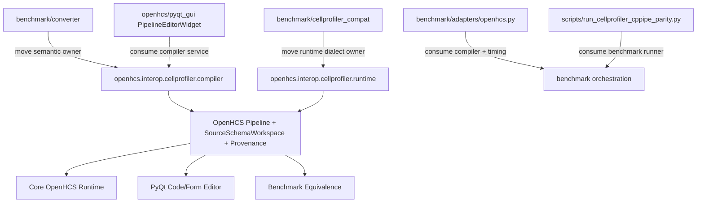
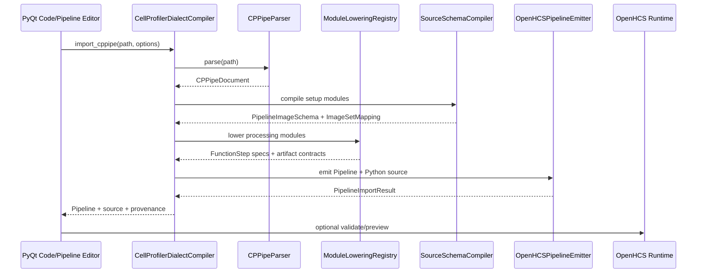
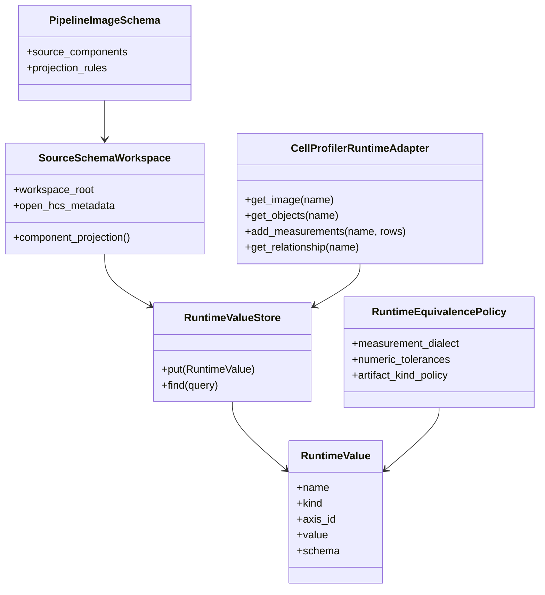
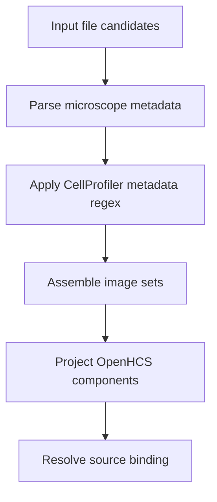
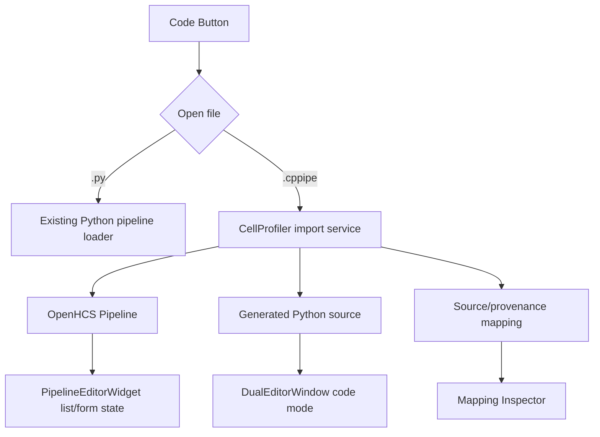
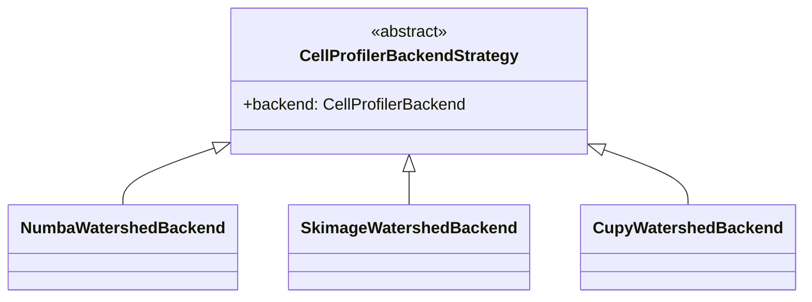

# Canonical CellProfiler Interop Architecture Plan

**Date:** 2026-05-04  
**Branch:** `benchmark-platform`  
**Status:** In progress / architecture lock-in  
**Audience:** OpenHCS runtime, benchmark, converter, backend, and PyQt UI work

## Purpose

OpenHCS now has enough CellProfiler parity evidence that the next risk is not
"can this run?" but "does the architecture remain canonical as compatibility,
benchmarking, UI import, and accelerated backends grow?"

This plan defines the target structure before more implementation work lands.
It uses the Nominal Refactor Advisor as design pressure, but the final choices
below are semantic decisions, not blind advisor output.

## Current Facts

- `.cppipe` pipelines can be parsed, lowered, generated, executed, validated,
  and compared through OpenHCS runtime artifacts.
- Runtime value, artifact, export, equivalence, source-schema workspace, and
  CellProfiler measurement dialect concepts now exist in OpenHCS/benchmark code.
- Explicit CellProfiler backend modules now exist under
  `openhcs.processing.backends.cellprofiler`.
- Numba is required and should be the default direction for CPU acceleration.
- PyQt6 is the active UI. Textual is deprecated for new integration work.
- The current `.cppipe` compiler/converter lives under `benchmark/converter`,
  which is backwards if PyQt and CLI need production CellProfiler import.

## Non-Negotiable Invariants

1. No semantic heuristics.

   Filename/path smells like `A01`, `Sequence`, `w1`, or folder names cannot
   define semantics by themselves. Semantics must come from microscope parsers,
   source-schema projection, CellProfiler setup modules, or explicit user input.

2. No silent fallback.

   Backends are explicit. Missing optional backends fail loudly or are omitted
   from selectable options. Required backends are declared as dependencies.

3. No untyped string backend selectors.

   Closed choices should use enums, nominal strategy classes, or
   `metaclass-registry` families keyed by stable nominal values.

4. The benchmark layer must not own product semantics.

   Benchmark can orchestrate, time, cache, validate, and compare. It should not
   be the canonical owner of `.cppipe` parsing, source-schema projection,
   module lowering, or pipeline generation once PyQt/CLI consume those features.

5. UI import must produce a normal OpenHCS pipeline.

   `.cppipe` import should compile into ordinary `Pipeline` / `FunctionStep`
   state plus provenance/mapping records. It should not create a black-box
   "CellProfiler runner" mode.

6. Runtime equivalence must remain typed.

   Output comparison should operate on runtime artifact kinds, measurement
   scopes, object identity, source image names, relationships, and dialect
   policies. It should not compare accidental file layouts.

7. Performance work must preserve semantics.

   Numba/CuPy replacements are valid only when they preserve the CellProfiler
   observable contract. Faster but semantically different code is a new backend
   only if explicitly named and tested as such.

8. Core runtime abstractions must not assume NumPy as the only array backend.

   Generic execution records should preserve OpenHCS memory/backend neutrality.
   If equivalence or export code materializes arrays to NumPy for hashing or
   comparison, that conversion must stay explicit at the snapshot/comparison
   boundary rather than leaking into runtime invocation semantics.

## Advisor Signals

Fresh focused scans were run against:

- `benchmark/cellprofiler_compat`
- `benchmark/converter`
- `openhcs/core`

The broad PyQt scan was stopped because it ran disproportionately long; PyQt
integration planning below is based on targeted source inspection of the active
pipeline editor/code path.

### Key Advisor Findings

| Area | Finding | Interpretation |
|---|---|---|
| `benchmark/cellprofiler_compat/module_execution.py` | Pattern 5, 14, 15, 17, 21 | This file is carrying too many roles: invocation planning, runtime binding, measurement row policy, output recording, execution strategies, and CP-specific source semantics. |
| `benchmark/cellprofiler_compat/runtime_adapter.py` | Pattern 14, 15 | Source candidate/provenance records and source binding stages need stronger constructor authorities and clearer phase boundaries. |
| `benchmark/converter` | Pattern 3, 5, 6, 14, 15, 16, 21 | Converter contains several closed families and repeated mapping records that should become dialect compiler registries/schemas. |
| `openhcs/core/runtime_equivalence.py` | Pattern 5, 14, 15, 16, 17, 21 | Equivalence is now load-bearing and too large; split into nominal staged comparison families. |
| `openhcs/core/runtime_values.py` | Pattern 5, 14, 17, 21 | Runtime value records should keep moving toward shared nominal constructors and strategy families. |
| `openhcs/core/orchestrator/orchestrator.py` | Pattern 4, 14, 15, 21 | Orchestrator remains an oversized control hub; relevant but not the first CP interop blocker. |

## Target Package Boundaries

The main ownership correction is to move product semantics out of `benchmark`.

```text
openhcs/
  interop/
    cellprofiler/
      parser.py
      dialect.py
      source_schema.py
      module_lowering.py
      pipeline_compiler.py
      provenance.py
      ui_projection.py
      validation.py
      measurement_dialect.py
      module_execution.py
      runtime_adapter.py
      settings/
      tests/

benchmark/
  adapters/
    openhcs.py
    cellprofiler.py
  converter/              # temporary compatibility shim, then delete
  cellprofiler_compat/    # temporary compatibility shim, then delete
  timing.py
  reports.py
```

### Boundary Rule

`openhcs.interop.cellprofiler` owns:

- `.cppipe` parsing.
- setup-module semantics.
- source-schema projection.
- module lowering.
- OpenHCS pipeline generation/import.
- CellProfiler measurement dialect.
- CP runtime adapter semantics needed by generated functions.
- CP provenance records.

`benchmark` owns:

- Running native CellProfiler.
- Running OpenHCS.
- Timing phases.
- Cache management.
- Equivalence orchestration.
- Report generation.
- Corpus management.

## Implemented So Far

- Product-facing `openhcs.interop.cellprofiler` namespace now owns stable
  parser, source-schema, settings, module-role, compiler contract, compiler
  registry, import request/result, and provenance records.
- Benchmark converter modules now provide compatibility shims for moved
  product-owned records instead of being the semantic owner.
- `.cppipe` import is exposed as an explicit `CellProfilerDialectCompiler`
  service registered through a fail-loud product registry.
- PyQt pipeline editor can route `.cppipe` files through the compiler service
  and populate ordinary `Pipeline` / `FunctionStep` state.
- Parser and generated-source persistence can use an explicit OpenHCS
  `FileManager` plus typed `Backend`; standalone disk behavior remains for CLI
  and tests.
- Benchmark phase timing exists as typed `BenchmarkPhase` records with JSONL
  and CSV writers that can use FileManager/VFS.
- Runtime equivalence report, policy, measurement key, cell-signature, and
  generic invocation records have started moving into package-owned OpenHCS core
  modules, with the monolithic modules retaining compatibility imports while
  staged ownership is established.

`openhcs.pyqt_gui` owns:

- User-facing import/open flows.
- Pipeline editor/code editor integration.
- Displaying provenance and source-schema mappings.
- Benchmark UI controls once timing exists.

## Current-To-Target Migration



## Canonical `.cppipe` Import Pipeline



## Proposed Product Types

These should exist outside `benchmark`.

```python
@dataclass(frozen=True, slots=True)
class CellProfilerPipelineImportRequest:
    cppipe_path: Path
    output_module_path: Path | None = None
    prune_unmaterialized_artifacts: bool = False


@dataclass(frozen=True, slots=True)
class CellProfilerPipelineImportResult:
    pipeline: Pipeline
    source_schema: PipelineImageSchema
    image_set_mapping: CellProfilerImageSetMapping
    provenance: CellProfilerPipelineProvenance
    generated_source: str
    artifact_contracts: tuple[ModuleArtifactContract, ...]


@dataclass(frozen=True, slots=True)
class CellProfilerPipelineProvenance:
    cppipe_path: Path
    module_count: int
    processing_module_count: int
    infrastructure_modules: tuple[str, ...]
    setup_modules: tuple[str, ...]
    unsupported_modules: tuple[str, ...]
```

## Runtime Semantics Model

The correct semantic model is not "CellProfiler workspace emulation." It is:



The adapter is a dialect façade over typed runtime values. It is not a mutable
CellProfiler workspace replacement and should not become one.

## Module Restructuring Plan

### 1. `module_execution.py`

Current problem:

- One file owns invocation classification, runtime input binding, special input
  binding, image execution strategies, output recording, measurement row
  completion, source provenance, object relationships, and classification
  record building.

Target split:

```text
openhcs/interop/cellprofiler/runtime/
  executor.py
  invocation.py
  image_execution.py
  input_binding/
    base.py
    objects.py
    special_inputs.py
    classify_objects.py
    filter_objects.py
  output_recording/
    base.py
    images.py
    objects.py
    measurements.py
    relationships.py
  measurements/
    rows.py
    completion.py
    dialect.py
    classification.py
  relationships.py
```

Advisor-backed refactor patterns:

- Pattern 15: split explicit nominal stages.
- Pattern 17: use strategy families for closed execution/output/input cases.
- Pattern 14: centralize repeated row/record builders.
- Pattern 5: move repeated execution skeletons into template-method bases.

Do not do this as a mechanical file split. First define the stage records:

```python
@dataclass(frozen=True, slots=True)
class CellProfilerInvocationPlan:
    image: Any
    kwargs: Mapping[str, Any]
    execution_mode: ImagePayloadExecutionMode
    source_image_name: str | None


@dataclass(frozen=True, slots=True)
class CellProfilerModuleExecutionResult:
    main_output: Any
    artifact_values: tuple[Any, ...]
    source_image_name: str | None
```

### 2. `runtime_equivalence.py`

Current problem:

- It is load-bearing and too large. It knows images, measurements, tables,
  dialect normalization, tolerances, object identity, source identity, and
  artifact path policies.

Target split:

```text
openhcs/core/equivalence/
  policy.py
  snapshot.py
  artifacts.py
  images.py
  tables.py
  measurements/
    dialect.py
    features.py
    rows.py
    compare.py
    tolerances.py
  references.py
  report.py
```

Runtime equivalence should become a staged pipeline:


Advisor-backed refactor patterns:

- Pattern 16: equivalence request/context records.
- Pattern 17: artifact-kind comparison strategy family.
- Pattern 14: authoritative measurement-row projection schemas.
- Pattern 15: staged comparison pipeline.

### 3. `runtime_adapter.py`

Current problem:

- Source binding and provenance are partially repeated across request records.

Target:

- Create one authoritative `ParsedSourceCandidate` / `SourceBindingCandidate`
  constructor family.
- Make source resolution a small staged pipeline:



The important invariant is that no stage guesses semantics from names. Each
stage carries provenance for why a semantic field exists.

### 4. `converter`

Current problem:

- The converter is both a production dialect compiler and a benchmark helper.
- Settings binding has many local closed families.

Target:

```text
openhcs/interop/cellprofiler/compiler/
  parser.py
  document.py
  source_schema.py
  module_partition.py
  module_lowering.py
  settings/
  symbol_table.py
  pipeline_emitter.py
  import_service.py
```

Closed families should be registries or declarative tables:

- Module setting binders.
- Module function resolution.
- Module artifact contract builders.
- Source-schema setup compilers.
- Execution validation rules.

### 5. PyQt UI

Current active UI:

- `openhcs/pyqt_gui/main.py`
- `openhcs/pyqt_gui/widgets/pipeline_editor.py`
- `DualEditorWindow`
- `pycodify` source generation path
- `ObjectState` form/state model

Target UX:



UI rules:

- `Code` mode should support `.py` and `.cppipe`.
- Loading `.cppipe` compiles to an OpenHCS pipeline and generated OpenHCS
  Python source.
- Saving is explicit:
  - Save as `.py` for OpenHCS pipeline.
  - Preserve `.cppipe` provenance.
  - Do not claim lossless `.cppipe` round-trip until explicitly implemented.
- Add a mapping inspector:
  - CP setup modules.
  - CP metadata regex fields.
  - image-set grouping.
  - OpenHCS components.
  - skipped infrastructure modules.
  - unsupported/degraded modules.

## Timing Architecture

Do not overload generic metrics for semantic phase timing. Add a dedicated
phase trace.

```python
class BenchmarkPhase(Enum):
    RESOLVE_SOURCE = auto()
    PARSE_CPPIPE = auto()
    COMPILE_DIALECT = auto()
    MATERIALIZE_SOURCE_SCHEMA = auto()
    INITIALIZE_RUNTIME = auto()
    COMPILE_OPENHCS = auto()
    EXECUTE_OPENHCS = auto()
    EXECUTE_NATIVE_CP = auto()
    VALIDATE_RUNTIME = auto()
    SNAPSHOT_OUTPUTS = auto()
    COMPARE_EQUIVALENCE = auto()
    WRITE_CACHE = auto()


@dataclass(frozen=True, slots=True)
class PhaseTimingRecord:
    run_id: str
    pipeline_name: str
    tool: str
    phase: BenchmarkPhase
    seconds: float
    cached: bool
```

Output should be long-table first:

```text
run_id,pipeline,tool,phase,seconds,cached
...
```

Graphs and PR tables should derive from that, not from ad hoc logs.

## Benchmark Report Semantics

Report all three timings separately:

1. Steady-state execution.
2. Adapter end-to-end without native process startup.
3. Full harness wall time including cache/materialization/comparison.

Do not compare OpenHCS startup against CellProfiler execution unless the table
explicitly says that is what is being measured.

## Backend Acceleration Plan

Backend work should follow this shape:



Rules:

- Numba CPU backend should be default where parity is proven.
- Centrosome/scikit-image can remain as explicit compatibility backends while
  replacement work continues.
- CuPy/CuCIM/pyclesperanto backends are future explicit strategies, not
  invisible acceleration.
- Each backend must have direct semantic tests against known CP behavior.
- If a backend is approximate, it must be named approximate and cannot be the
  default parity backend.

Priority modules:

| Priority | Module/Area | Reason |
|---|---|---|
| P0 | Watershed/declump/propagation | Runtime hotspot and segmentation semantic core. |
| P0 | Region properties / size-shape | Used broadly across measurement modules. |
| P0 | MeasureGranularity | Known high runtime cost. |
| P1 | Texture/Zernike | Expensive and shared across pipelines. |
| P1 | RelateObjects / relationships | Load-bearing for downstream measurement semantics. |
| P1 | IdentifyObjectsInGrid | Known slow and semantically dense. |
| P2 | Colocalization / correlation | Vectorizable, important for CP example coverage. |

## Implementation Phases

### Phase 1: Documented Boundary Extraction

Goal: create product-facing package scaffolding without moving everything at
once.

Tasks:

- Add `openhcs/interop/cellprofiler/`.
- Move/copy only stable leaf records first:
  - measurement dialect.
  - provenance records.
  - import request/result records.
  - source-schema mapping records.
- Add compatibility re-exports from `benchmark`.
- Tests must prove imports still work from old benchmark paths.

### Phase 2: Compiler Service Extraction

Goal: make `.cppipe -> OpenHCS Pipeline` a product service.

Tasks:

- Extract `CellProfilerDialectCompiler`.
- Route `prepare_generated_pipeline` through it.
- Keep generated code path stable.
- Add a pure import test that does not execute the pipeline.
- Add `.cppipe` import result provenance tests.

### Phase 3: PyQt Code Mode Integration

Goal: load `.cppipe` beside `.py`.

Tasks:

- Extend code loader file dialog filters to include `.cppipe`.
- Route `.cppipe` files through `CellProfilerDialectCompiler`.
- Populate `pipeline_steps` and ObjectState from imported `Pipeline`.
- Open generated Python in the existing dual editor.
- Add a mapping/provenance inspector window.

### Phase 4: Timing

Goal: produce credible benchmark figures without phase confusion.

Tasks:

- Add `benchmark/timing.py`.
- Instrument native CP adapter and OpenHCS adapter with semantic phases.
- Emit JSONL/CSV phase records.
- Add report helper for per-pipeline summary and speedup tables.

### Phase 5: Runtime Hub Decomposition

Goal: reduce future edit risk.

Tasks:

- Split `module_execution.py` into invocation/input/output/measurement modules.
- Split `runtime_equivalence.py` into staged equivalence package.
- Keep compatibility imports until all call sites migrate.
- Add narrow regression tests for each stage.

### Phase 6: Backend Hardening

Goal: make faster backends default only after parity proof.

Tasks:

- Add microbenchmarks per backend.
- Add parity fixtures per CP primitive.
- Replace remaining hotspots with explicit Numba strategies.
- Add optional GPU strategy slots without silent fallback.

## Suggested First PR After This Plan

Do **not** start with the giant file split. Start with the ownership boundary.

First PR:

1. Add `openhcs/interop/cellprofiler/__init__.py`.
2. Add `openhcs/interop/cellprofiler/import_result.py`.
3. Add `openhcs/interop/cellprofiler/provenance.py`.
4. Move `measurement_dialect.py` or re-export it through the new namespace.
5. Add compatibility imports in `benchmark/cellprofiler_compat`.
6. Add tests proving both old and new import paths work.

Why:

- Small surface.
- Low semantic risk.
- Establishes package ownership.
- Enables PyQt and benchmark to depend on the same namespace.

## Open Questions

1. Should `openhcs.interop.cellprofiler` be part of core install or an extra?

   Recommendation: core import records and compiler interfaces live in core
   package; native CP execution dependencies remain optional extras.

2. Should generated CP functions remain under `benchmark/cellprofiler_library`?

   Recommendation: eventually no. Product-facing absorbed functions should move
   under `openhcs/interop/cellprofiler/functions` or
   `openhcs/processing/backends/cellprofiler`, with benchmark keeping corpus and
   comparison logic only.

3. Should PyQt import `.cppipe` through Code mode only or also menu action?

   Recommendation: both paths call the same service. Code mode gets file
   support first; a menu action can be a thin alias.

4. Should `.cppipe` export/round-trip be supported?

   Recommendation: not now. Import is canonical. Export back to `.cppipe` is a
   separate lossy/lossless dialect problem.

## Success Criteria

- Benchmark no longer owns CellProfiler semantics.
- PyQt can load `.cppipe` into ordinary OpenHCS pipeline/code state.
- Phase timing distinguishes execution from startup/materialization/equivalence.
- Runtime equivalence and module execution are staged and testable.
- Backend selection remains explicit, typed, and fail-loud.
- All existing parity tests remain green during migration.
