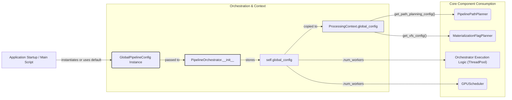

# Implementation Plan: Python Object-Based Global Configuration for OpenHCS

**Date:** 2025-05-21
**Version:** 1.0
**Based on:** `PLANS_CONFIG_REFACTOR.md` and subsequent architectural discussions.

## 1. Overarching Goal

To implement a modernized, centralized configuration system for OpenHCS that:
1.  Is defined directly as Python objects using immutable dataclasses.
2.  Provides clear, type-safe configuration for VFS, path planning, and general pipeline behavior.
3.  Eliminates outdated configuration mechanisms from [`openhcs/core/config.py`](openhcs/core/config.py:1).
4.  Ensures configuration is primarily established at application startup (via default Python objects or user-provided instances) and passed consistently through core components like `PipelineOrchestrator` and `ProcessingContext`.

## 2. Key Approach: Python Object-Based Configuration

*   **Dataclasses:** Configuration will be structured using `@dataclass(frozen=True)` for immutability.
*   **No External Files for Loading:** The system will not rely on YAML/JSON files for loading the primary configuration. Instead, configuration will be instantiated as Python objects.
*   **Default Configuration:** A function (e.g., `get_default_global_config()`) will provide a default-initialized `GlobalPipelineConfig` instance.
*   **Injection:** `PipelineOrchestrator` will either accept a pre-configured `GlobalPipelineConfig` instance or use the default. This config object will then be propagated to `ProcessingContext` and consumed by relevant core components.

## 3. Phased Implementation Plan

### Phase 1: Define New Configuration Dataclasses

**Location:** Refactor [`openhcs/core/config.py`](openhcs/core/config.py:1) to contain these new definitions.

**Dataclass Definitions:**

```python
from dataclasses import dataclass, field
from typing import Literal, Optional, Union # Add Any, Dict if needed for future extensions
from pathlib import Path
import logging # For logger in default provider if used there

# It's good practice for logger to be configured at application level
# For this example, assuming a logger instance is available if get_default_global_config uses it.
# logger = logging.getLogger(__name__) 

@dataclass(frozen=True)
class VFSConfig:
    default_intermediate_backend: Literal["memory", "disk", "zarr"] = "memory"
    default_materialization_backend: Literal["disk", "zarr"] = "disk"
    persistent_storage_root_path: Optional[str] = None # e.g., "./hcs_data_root" or absolute path

@dataclass(frozen=True)
class PathPlanningConfig:
    output_dir_suffix: str = "_outputs"
    positions_dir_suffix: str = "_positions"
    stitched_dir_suffix: str = "_stitched"
    # Add other path-related suffixes as needed

@dataclass(frozen=True)
class GlobalPipelineConfig:
    num_workers: int = 1 # Consider os.cpu_count() as a more dynamic default
    path_planning: PathPlanningConfig = field(default_factory=PathPlanningConfig)
    vfs: VFSConfig = field(default_factory=VFSConfig)
    # Future: Add other global settings like logging configurations, plugin settings, etc.

# Example default provider function (could be in this file or a separate defaults.py)
_DEFAULT_PATH_PLANNING_CONFIG = PathPlanningConfig() # Uses defaults from PathPlanningConfig
_DEFAULT_VFS_CONFIG = VFSConfig() # Uses defaults from VFSConfig

def get_default_global_config() -> GlobalPipelineConfig:
    # logger.info("Providing default GlobalPipelineConfig.") # Optional logging
    return GlobalPipelineConfig(
        num_workers=1, # Or more dynamic default like: os.cpu_count() or 4
        path_planning=_DEFAULT_PATH_PLANNING_CONFIG,
        vfs=_DEFAULT_VFS_CONFIG
    )
```

### Phase 2: Configuration Instantiation (Python Object-Based)

1.  **Default Provider:** Implement `get_default_global_config()` as shown above, likely within [`openhcs/core/config.py`](openhcs/core/config.py:1) or a new `openhcs/config/defaults.py`.
2.  **`PipelineOrchestrator` Update:**
    *   Modify `PipelineOrchestrator.__init__` in [`openhcs/core/orchestrator/orchestrator.py`](openhcs/core/orchestrator/orchestrator.py:1) to accept `global_config: Optional[GlobalPipelineConfig] = None`.
    *   If `global_config is None`, the orchestrator calls `get_default_global_config()` to initialize `self.global_config`. Otherwise, it uses the provided instance.
    ```python
    # Example snippet for PipelineOrchestrator.__init__
    # from openhcs.core.config import GlobalPipelineConfig, get_default_global_config # Adjust import

    # def __init__(self, ..., global_config: Optional[GlobalPipelineConfig] = None, ...):
    #     # ...
    #     if global_config is None:
    #         self.global_config = get_default_global_config()
    #         # logger.info("PipelineOrchestrator using default global configuration.")
    #     else:
    #         self.global_config = global_config
    #     # ...
    ```

### Phase 3: Integrate `GlobalPipelineConfig` into Core Components

1.  **`PipelineOrchestrator` ([`openhcs/core/orchestrator/orchestrator.py`](openhcs/core/orchestrator/orchestrator.py:1)):**
    *   In `create_context`, set `context.global_config = self.global_config`.
    *   In `execute_compiled_plate`, modify `max_workers: int = DEFAULT_NUM_WORKERS` to `max_workers: Optional[int] = None`. If `max_workers is None`, use `self.global_config.num_workers`. Remove the direct import and usage of `DEFAULT_NUM_WORKERS`.

2.  **`ProcessingContext` ([`openhcs/core/context/processing_context.py`](openhcs/core/context/processing_context.py:1)):**
    *   Add attribute: `global_config: GlobalPipelineConfig`.
    *   Add getter methods: `get_vfs_config() -> VFSConfig`, `get_path_planning_config() -> PathPlanningConfig`, `get_num_workers() -> int`.

3.  **`PipelinePathPlanner` ([`openhcs/core/pipeline/path_planner.py`](openhcs/core/pipeline/path_planner.py:1)):**
    *   Ensure its methods can access `ProcessingContext`.
    *   Update to use `context.get_path_planning_config().output_dir_suffix` (and for `positions_dir_suffix`, `stitched_dir_suffix`) instead of directly imported constants like `DEFAULT_OUT_DIR_SUFFIX`. Remove these direct constant imports.

4.  **`MaterializationFlagPlanner` ([`openhcs/core/pipeline/materialization_flag_planner.py`](openhcs/core/pipeline/materialization_flag_planner.py:1)):**
    *   Ensure its methods can access `ProcessingContext`.
    *   Update to use `context.get_vfs_config().default_intermediate_backend` and `context.get_vfs_config().default_materialization_backend`.

5.  **`GPUScheduler` ([`openhcs/core/orchestrator/gpu_scheduler.py`](openhcs/core/orchestrator/gpu_scheduler.py:1)):**
    *   Update to use `global_config.num_workers` (passed to it or obtained from `ProcessingContext`/`PipelineOrchestrator`) as a fallback for `max_cpu_threads`, instead of `DEFAULT_NUM_WORKERS`. Remove direct import of `DEFAULT_NUM_WORKERS`.

### Phase 4: Cleanup and Deprecation

1.  **Remove Old Config Classes:** Delete `PipelineConfig`, `MISTConfig`, `BackendConfig`, `StitcherConfig` from [`openhcs/core/config.py`](openhcs/core/config.py:1).
2.  **Remove Old Constant Imports:** Remove direct imports of `DEFAULT_OUT_DIR_SUFFIX`, `DEFAULT_NUM_WORKERS`, etc., from modules that now consume these values from `GlobalPipelineConfig`.

## 4. Visual Flow of Configuration



## 5. Future Considerations (Post Initial Refactor)
*   Mechanism for user-friendly overrides if direct Python object modification is not desired for all users (e.g., a layered approach with optional YAML override for specific deployments).
*   Handling of sensitive configuration values.
*   Schema for any potential future file-based overrides.