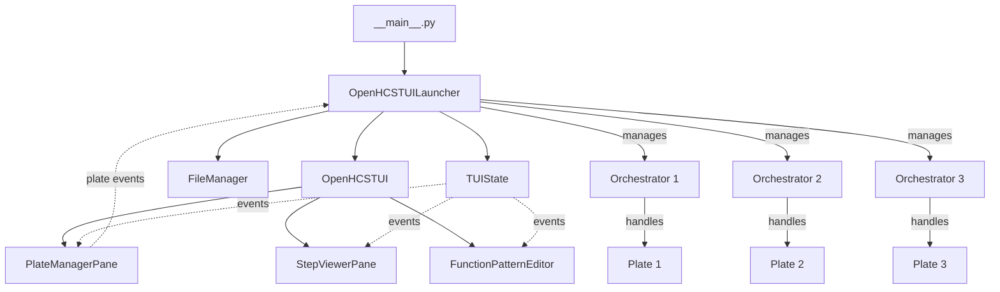

# TUI Launcher Implementation Plan

**Date:** 2025-05-21  
**Version:** 1.0  
**Author:** Roo  
**Plan Index:** 12

## Overview

This document outlines a plan for implementing a standalone TUI launcher for OpenHCS, which will serve as the entry point for the Terminal User Interface. The launcher will integrate all existing TUI components (PlateManagerPane, StepViewerPane, FunctionPatternEditor) and create a separate orchestrator instance for each plate.

## Design Goals

1. Create a clean entry point for the OpenHCS TUI
2. Integrate existing TUI components
3. Implement per-plate orchestrator management
4. Ensure proper event-based communication between components
5. Handle errors and cleanup gracefully

## Architecture



## Component Responsibilities

### 1. Entry Point (`__main__.py`)

- Parse command line arguments
- Configure logging
- Initialize the launcher
- Run the TUI application

### 2. TUI Launcher (`tui_launcher.py`)

- Create shared components (FileManager, TUIState)
- Initialize the OpenHCSTUI with default context
- Create and manage orchestrators for each plate
- Connect event handlers for plate management
- Handle cleanup on exit

### 3. TUI State

- Store and manage application state
- Provide event-based communication between components
- Track the active orchestrator

### 4. OpenHCSTUI

- Integrate all TUI components
- Handle layout and navigation

## Implementation Plan

### Phase 1: Entry Point Implementation

1. Create `openhcs/tui/__main__.py`
   - Set up argument parsing
   - Configure logging
   - Initialize the launcher
   - Run the application

### Phase 2: TUI Launcher Implementation

1. Create `openhcs/tui/tui_launcher.py`
   - Implement OpenHCSTUILauncher class
   - Set up orchestrator management
   - Connect event handlers

### Phase 3: Component Integration

1. Update existing components to work with the launcher:
   - Ensure PlateManagerPane emits proper events
   - Configure StepViewerPane to work with active orchestrator
   - Update FunctionPatternEditor to access the active orchestrator

## Doctrinal Constraints

The implementation must adhere to the following doctrinal constraints:

1. **VFS Exclusivity (Clause 17)**
   - All file operations must use FileManager, not direct OS calls

2. **TUI_NO_VIRTUALPATH_EXPOSURE (Clause 319)**
   - TUI must work only with plain strings, not VirtualPath objects

3. **TUI_STATUS_THREADSAFETY (Clause 317)**
   - All updates to state must be serialized through locks

4. **TUI_FILEMANAGER_INJECTION (Clause 315)**
   - All TUI managers must receive context.filemanager

5. **Component Boundaries (Clause 295)**
   - Maintain clear boundaries between components with explicit interfaces

## Code Structure

### `openhcs/tui/__main__.py`

```python
"""
OpenHCS TUI entry point.

This module provides a standalone entry point for the OpenHCS TUI,
creating separate orchestrators per plate.
"""
import argparse
import asyncio
import logging
import os
import sys
from pathlib import Path

from openhcs.tui.tui_launcher import OpenHCSTUILauncher


async def main():
    """Main entry point for OpenHCS TUI."""
    # Parse command line arguments
    parser = argparse.ArgumentParser(description="OpenHCS Terminal User Interface")
    parser.add_argument("--debug", action="store_true", help="Enable debug logging")
    parser.add_argument("--workspace", type=str, default=None,
                        help="Default workspace directory")
    parser.add_argument("--config", type=str, default=None,
                        help="Path to configuration file")
    args = parser.parse_args()

    # Configure logging
    log_level = logging.DEBUG if args.debug else logging.INFO
    logging.basicConfig(level=log_level, 
                       format='%(asctime)s - %(name)s - %(levelname)s - %(message)s')
    logger = logging.getLogger("openhcs.tui")
    
    # Initialize launcher
    launcher = OpenHCSTUILauncher(
        default_workspace_path=args.workspace,
        config_path=args.config
    )
    
    # Run the TUI application
    await launcher.run()


if __name__ == "__main__":
    try:
        sys.exit(asyncio.run(main()))
    except KeyboardInterrupt:
        sys.exit(0)
```

### `openhcs/tui/tui_launcher.py`

```python
"""
OpenHCS TUI Launcher.

Creates and manages the TUI application, initializing all required components
and creating per-plate orchestrators.

🔒 Clause 17 — VFS Exclusivity
All file operations must use FileManager, not direct OS calls.

🔒 Clause 315: TUI_FILEMANAGER_INJECTION
All TUI managers must receive context.filemanager.

🔒 Clause 317: TUI_STATUS_THREADSAFETY
All updates to state.operation_status must be serialized through a lock.

🔒 Clause 319: TUI_NO_VIRTUALPATH_EXPOSURE
TUI must work only with plain strings, not VirtualPath objects.
"""
import asyncio
import logging
from pathlib import Path
from typing import Dict, Optional

from openhcs.constants.constants import Backend
from openhcs.core.context.processing_context import ProcessingContext
from openhcs.core.orchestrator.orchestrator import PipelineOrchestrator
from openhcs.io.filemanager import FileManager
from openhcs.tui.tui_architecture import OpenHCSTUI, TUIState


class OpenHCSTUILauncher:
    """
    Launcher for the OpenHCS TUI.
    
    Creates and manages the TUI application, initializing components and orchestrators.
    """
    def __init__(self, default_workspace_path: Optional[str] = None,
                 config_path: Optional[str] = None):
        """Initialize the launcher with optional paths."""
        self.logger = logging.getLogger(__name__)
        self.default_workspace_path = Path(default_workspace_path) if default_workspace_path else None
        self.config_path = Path(config_path) if config_path else None
        
        # Dictionary to store orchestrators by plate ID
        self.orchestrators: Dict[str, PipelineOrchestrator] = {}
        self.orchestrators_lock = asyncio.Lock()
        
        # Initialize shared components
        self.filemanager = FileManager()
        self.state = TUIState()
        
        # Create a default context for initialization
        self.default_context = ProcessingContext(filemanager=self.filemanager)
        
        # Register for events
        self.state.add_observer('plate_added', self._on_plate_added)
        self.state.add_observer('plate_removed', self._on_plate_removed)
        self.state.add_observer('plate_selected', self._on_plate_selected)
        
    async def _on_plate_added(self, plate):
        """Create a new orchestrator when a plate is added."""
        plate_id = plate['id']
        plate_path = plate['path']
        backend = plate['backend']
        
        # Thread-safe orchestrator creation
        async with self.orchestrators_lock:
            # Only create if not already exists
            if plate_id not in self.orchestrators:
                # Create workspace path based on plate path
                workspace_path = None
                if self.default_workspace_path:
                    # Use default workspace with plate name subfolder
                    workspace_path = self.default_workspace_path / f"plate_{plate_id}"
                
                # Create orchestrator for this plate
                orchestrator = PipelineOrchestrator(
                    plate_path=plate_path, 
                    workspace_path=workspace_path,
                )
                
                # Initialize orchestrator with proper backend
                try:
                    orchestrator.initialize(storage_backend=backend)
                    self.orchestrators[plate_id] = orchestrator
                    
                    # Notify success
                    self.state.notify('plate_status_changed', {
                        'plate_id': plate_id,
                        'status': 'ready'
                    })
                except Exception as e:
                    # Notify error
                    self.state.notify('error', {
                        'source': 'OpenHCSTUILauncher',
                        'message': f"Failed to initialize orchestrator for plate {plate_id}",
                        'details': str(e)
                    })
                    self.state.notify('plate_status_changed', {
                        'plate_id': plate_id,
                        'status': 'error'
                    })
    
    async def _on_plate_removed(self, plate):
        """Clean up orchestrator when a plate is removed."""
        plate_id = plate['id']
        
        # Thread-safe orchestrator removal
        async with self.orchestrators_lock:
            if plate_id in self.orchestrators:
                # Clean up orchestrator
                del self.orchestrators[plate_id]
    
    async def _on_plate_selected(self, plate):
        """Handle plate selection by updating the active context."""
        plate_id = plate['id']
        
        # Thread-safe orchestrator access
        async with self.orchestrators_lock:
            if plate_id in self.orchestrators:
                # Get orchestrator for this plate
                orchestrator = self.orchestrators[plate_id]
                
                # Create a new context from this orchestrator
                # This will be used by components that need plate-specific context
                self.state.active_orchestrator = orchestrator
                
                # Notify components that need to update
                self.state.notify('active_orchestrator_changed', {
                    'orchestrator': orchestrator,
                    'plate_id': plate_id
                })
    
    async def run(self):
        """
        Run the TUI application.
        
        This initializes components and runs the prompt_toolkit application.
        """
        # Create TUI components
        tui = OpenHCSTUI(self.default_context)
        
        # Run the application
        self.logger.info("Starting OpenHCS TUI")
        await tui.application.run_async()
        
        # Cleanup on exit
        self.logger.info("OpenHCS TUI exited, cleaning up")
        await self._cleanup()
    
    async def _cleanup(self):
        """Clean up resources when the application exits."""
        # Thread-safe cleanup
        async with self.orchestrators_lock:
            # Clean up all orchestrators
            for plate_id, orchestrator in list(self.orchestrators.items()):
                try:
                    # Any necessary cleanup for orchestrators
                    self.logger.info(f"Cleaning up orchestrator for plate {plate_id}")
                except Exception as e:
                    self.logger.error(f"Error cleaning up orchestrator for plate {plate_id}: {str(e)}")
```

## Testing Strategy

1. **Unit Tests**
   - Test orchestrator creation and management
   - Test event handling for plate events
   - Test proper cleanup on exit

2. **Integration Tests**
   - Test TUI components integration
   - Test end-to-end workflow with multiple plates
   - Test error handling and recovery

3. **Manual Testing**
   - Verify UI responsiveness and layout
   - Test keyboard and mouse navigation
   - Verify proper per-plate orchestrator isolation

## Implementation Timeline

1. **Phase 1: Entry Point Implementation** - 1 day
2. **Phase 2: TUI Launcher Implementation** - 2 days
3. **Phase 3: Component Integration** - 2 days
4. **Testing and Refinement** - 1 day

## Conclusion

This plan provides a comprehensive approach for implementing a standalone TUI launcher for OpenHCS. By creating dedicated orchestrator instances per plate and integrating existing TUI components, we can provide a clean entry point while maintaining separation of concerns and adhering to OpenHCS's doctrinal constraints.